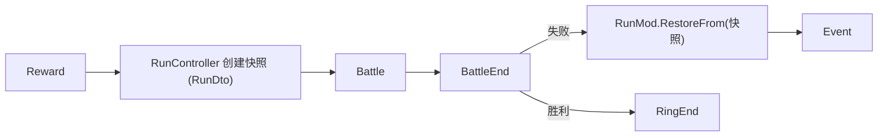

# 局内数据模块 (Run Mod) 设计规范

## 概述

Run Mod 管理一次游戏流程（Run）中跨战斗、跨事件持续存在的所有数据和逻辑。采用怪物火车式循环模型：数轮事件/奖励 → 强力战斗 → 重复 2-3 环（环数等可由故事脚本白名单覆盖，见总规格）。

定位为 combat 模块的上层编排者，通过 MVC 模式组织，与项目现有的 `GlobalMod` 架构保持一致。

> **权威冲突**：玩法边界以 [2026-05-11-kemo-card-design.md](./2026-05-11-kemo-card-design.md) 为准。下文若与总规格冲突（尤其奖励分发、CardCollection 语义、开局角色、潜能/被动、SharedHp 生命周期、修饰归属），以总规格为准并以下文「已对齐」段落为准。

---

## 1. 模块结构与架构

### 目录结构

```
Src/mod/run/
├── RunMod.cs                  # Run级数据持有（继承 BaseMod）
├── RunController.cs           # Run生命周期编排（继承 BaseController<RunMod>）
├── RunRuntime.cs              # 当前 Run 会话门面（CreateNew / Abandon）
├── RunDto.cs                  # 可序列化的 Run 快照（存档用）
├── PlayerRunState.cs          # 每个槽位的玩家私有数据
├── PlayerRunStateDto.cs       # PlayerRunState 的可序列化快照
├── RunConstants.cs            # Run常量（上阵上限、奖励数量等）
├── ERunPhase.cs               # Run阶段枚举
│
├── save/
│   └── RunSaveService.cs      # Run存档的序列化/反序列化
│
├── reward/
│   └── RunRewardDistributor.cs # 奖励分发逻辑
│
├── Ui/
│   ├── StorySelectDlg.cs/.tscn  # 选故事界面（Dialog）
│   └── RunMainWin.cs/.tscn      # Run 主界面（Window 壳）
│
└── events/
    └── RunEventBus.cs          # Run级事件定义
```

### 核心类型关系

```
RunMod (BaseMod)
├── [共享] RunId, StoryId, CurrentRing, MaxRing, Phase, RunSeed, IsMultiplayer
├── [共享] ExperiencedBattles / ExperiencedEvents ── 账本（去重用，见总规格 4.3）
├── [共享] BattleHistory ── 战斗统计（与账本分离，失败也可记录，不参与去重）
├── [共享] CharacterPool ── List<CharacterInstance> ── 全队共享角色池（定义唯一；含潜能解放）
├── [共享] CardCollection ── HashSet<string> ── 全队共享卡牌收集
├── [单人] SharedGold ── int ── 仅单人模式使用，多人模式下忽略
├── [单人] SharedModifiers ── List<RunModifier> ── 单人共享 Run 修饰（联机用槽位 Modifiers）
├── PlayerControllers ── List<PlayerController> ── 房间内的人类玩家列表（单人含 1 个 local）
│        ├── PlayerId  ── 唯一标识
│        ├── DisplayName ── 显示名
│        └── IsOwner   ── 是否为房主
├── SlotOwnership ── Dictionary<int, string> ── slotIndex(0-3) → playerId
│        └── 必须保持 4 个槽位全部分配才能进入战斗
└── PlayerRunState[4] ── 按槽位索引（0-3），每槽位独立数据
         ├── ActiveCharacter ── 当前上阵角色（从共享池选取，null=未上阵）
         ├── Gold            ── 仅多人模式的该槽位金币（单人模式金币在 SharedGold）
         ├── Modifiers       ── 仅多人：该槽位的 Run 修饰器列表
         └── EventFlags      ── 该槽位的事件标记

ActiveParty 是计算属性：
  PlayerRunState[0..3].ActiveCharacter   ── 全部4个必须非null才能进入战斗
```

**金币存储规则**：单人模式（`IsMultiplayer == false`）→ `RunMod.SharedGold`，全队共享。多人模式（`IsMultiplayer == true`）→ 每槽位 `PlayerRunState.Gold`，即使只有 1 名真实玩家也按多人规则。

**控制权与槽位数据的分离**：`SlotOwnership` 管理"谁在操作这个槽位"，`PlayerRunState` 管理"槽位的游戏数据"。一个人类玩家可以控制多个槽位。奖励分发：联机绑槽；单人走细粒度共享层（见 §5，不以「每槽一份」为单人权威）。

### 架构关系

```
RunController (编排者)
├── → RunMod (数据持有)
├── → RunSaveService (持久化)
├── → RunRewardDistributor (奖励逻辑)
└── → CombatSimulationFactory.TryCreate() (创建战斗)

RunController 是 Run 的唯一对外入口，所有操作通过它进行。
```

---

## 2. Run 生命周期与阶段流转

### ERunPhase

```
Init        ── Run创建：奖励分发、初始化角色池和编队
Event       ── 事件阶段：展示事件选项、玩家选择
Reward      ── 奖励结算：事件选择结果生效、分发奖励
Battle      ── 战斗阶段：创建 CombatSimulation、战斗进行中
BattleEnd   ── 战斗结算：处理战斗结果、收集战利品
RingEnd     ── 环结束：判断进入下一环或结束Run
Finished    ── Run结束（终态，用于结算和成就判定）
```

### 阶段流转

```
Init → Event → Reward → Event → Reward → ... → Reward → Battle → BattleEnd
                                                                ├── 胜利 → RingEnd → Event / Finished
                                                                └── 失败 → 回滚快照 → Event

所有阶段均可通过 RunController.AbandonRun() 跳转到 Finished。
```

### 战斗失败回滚机制



- `RunController.StartBattle()` 调用时内部创建 `_battleSnapshot = RunMod.ToDto()`（纯内存操作）
- `RunController.EndBattle()` 检测到失败时执行 `RunMod.RestoreFrom(_battleSnapshot)` 回滚
- 战斗中消耗的药水/金币、修饰 charges、临时获得等 **全部撤销**（总规格：失败 = 纯时间成本，完整快照回滚）
- 回滚后 Run 回到 Event 阶段，玩家可调整编队后重新战斗；无失败资源税、可无限重试

### RunController 公开 API

```csharp
// 生命周期（storyId 必选：Run 开始前必须选定故事脚本，总规格 4.1）
RunDto CreateRun(string storyId, HostRng rng, IReadOnlyList<CharacterDto> candidates, bool isMultiplayer);
RunDto LoadRun(RunDto dto);
RunDto AbandonRun();

// 队伍管理
// 角色池管理（全队共享）
bool AddToCharacterPool(CharacterInstance character);
bool RemoveFromCharacterPool(string instanceId);
// 编队（按槽位，从共享角色池中选择）
bool SetActiveCharacter(int slotIndex, int poolIndex);
bool UnsetActiveCharacter(int slotIndex);
// 卡牌收集（全队共享）
bool AddCard(string cardId);
bool RemoveCard(string cardId);
// 金币
int GetGold(int? slotIndex = null);                          // 单人传 null，多人传 slotIndex
bool SpendGold(int slotIndex, int amount);                   // 花费金币
bool AddGold(int slotIndex, int amount);                     // 获得金币（单人 slotIndex 忽略）
bool TransferGold(int fromSlot, int toSlot, int amount);     // 仅多人，需双方同意
// 校验
bool ValidateParty();                                         // 4个槽位全部非null

// 事件
void BeginEventPhase(int ringIndex, int eventIndex);
void SelectEventOption(int slotIndex, int optionIndex);
void ApplyEventRewards();

// 战斗
CombatSimulation StartBattle(GameDefinitionRegistry definitions, HostRng rng, int runSeed);
void EndBattle(CombatSimulation simulation, bool won);

// 流程控制
void NextRing();
bool HasNextRing();

// 控制权管理（联机用，仅非战斗阶段可主动调用）
bool AssignSlot(int slotIndex, string playerId);
void OnPlayerDisconnected(string playerId);
bool SwapSlotOwnership(int slotA, int slotB, string initiatorId, string targetId);
bool AllSlotsAssigned();
IReadOnlyList<int> GetSlotsForPlayer(string playerId);

// 持久化
void Save(RunSaveService saveService);
bool TryLoad(RunSaveService saveService, out RunDto dto);
```

---

## 3. 数据模型

### RunDto（可序列化快照）

```csharp
public sealed record RunDto
{
    // 标识
    public string RunId { get; init; }
    public string StoryId { get; init; }               // Run 开始前必选的故事脚本 id（总规格 4.1）
    public int SchemaVersion { get; init; }
    public DateTime CreatedAt { get; init; }
    public DateTime UpdatedAt { get; init; }

    // 进度
    public int CurrentRing { get; init; }
    public int MaxRing { get; init; }
    public ERunPhase Phase { get; init; }
    public int RunSeed { get; init; }
    public string RngStreamState { get; init; }        // 宿主 RNG 流状态（可复现，总规格 5.3.1）

    // 多人
    public bool IsMultiplayer { get; init; }
    public List<PlayerControllerDto> PlayerControllers { get; init; }  // 房间内人类玩家
    public Dictionary<int, string> SlotOwnership { get; init; }        // slotIndex→playerId

    // 全队共享
    public List<CharacterPoolEntryDto> CharacterPool { get; init; }    // 全队共享角色池
    public List<string> CardCollection { get; init; }                  // 全队共享卡牌收集
    public int SharedGold { get; init; }                               // 单人模式全队共享金币
    public List<RunModifierDto> SharedModifiers { get; init; }         // 单人共享 Run 修饰（总规格 4.7）

    // 账本（去重用，总规格 4.3；仅不可逆提交点写入）
    public List<string> ExperiencedBattles { get; init; }              // 已胜利入账的战斗定义 id
    public List<string> ExperiencedEvents { get; init; }               // 已生效入账的事件定义 id

    // 当前阶段未提交的选项（若存在；事件/奖励选项刷新后尚未生效时随档保存，总规格 5.3.1）
    public PendingChoiceDto? PendingChoice { get; init; }

    // 每槽位玩家私有数据（length=4，全队共享数据不在此处）
    public List<PlayerRunStateDto> PlayerStates { get; init; }

    // 共享历史（纯统计，与账本分离；失败也可记录，不参与去重）
    public List<BattleRecordDto> BattleHistory { get; init; }

    // 诊断（总规格 5.3.1：加载不一致须提示风险）
    public Dictionary<string, string> DefinitionVersions { get; init; } // 各管理器内容版本/哈希摘要
}
```

### PlayerControllerDto

```csharp
public sealed record PlayerControllerDto
{
    public string PlayerId { get; init; }
    public string DisplayName { get; init; }
    public bool IsOwner { get; init; }
}
```

### PlayerRunStateDto

```csharp
public sealed record PlayerRunStateDto
{
    public int? ActiveCharacterIndex { get; init; }    // 共享池中索引，null=未上阵
    public int Gold { get; init; }                     // 仅多人模式的槽位金币
    public List<RunModifierDto> Modifiers { get; init; }
    public Dictionary<string, object> EventFlags { get; init; }
}
```

### CharacterPoolEntryDto

```csharp
public sealed record CharacterPoolEntryDto
{
    public string DefinitionId { get; init; }
    public string InstanceId { get; init; }
    public int PotentialLiberation { get; init; } // 潜能解放 [0,100]；重复角色 +20 后 clamp
    public List<DeckSnapshotDto> Decks { get; init; }
    public int CurrentDeckIndex { get; init; }
}

public sealed record DeckSnapshotDto
{
    public List<string> CardIds { get; init; }
}
```

### RunModifierDto

> **已对齐总规格 4.7**：修饰是开战技能引用 + charges，不再是 float 数值袋。

```csharp
public sealed record RunModifierDto
{
    public string ModifierId { get; init; }   // 稳定 id（内容/诊断）
    public string SkillId { get; init; }      // 开战释放的技能引用
    public int Charges { get; init; }         // <=0（-1 或 0）常驻；>=1 消耗型
    public string Source { get; init; }
}
```

### BattleRecordDto

```csharp
public sealed record BattleRecordDto
{
    public string BattleId { get; init; }
    public bool Won { get; init; }
    public int TurnsUsed { get; init; }
    public int DamageDealt { get; init; }
    public int DamageTaken { get; init; }
}
```

### PendingChoiceDto

```csharp
public sealed record PendingChoiceDto
{
    public string SourceId { get; init; }        // 产生选项的事件/奖励来源定义 id
    public List<string> OptionIds { get; init; } // 已刷新但未生效的选项（不入账本，可再次出现）
}
```

### RunConstants 常量

```csharp
public static class RunConstants
{
    public const int MaxPlayers = 4;
    public const int SlotCount = 4;
    public const int MaxSlotsPerPlayer = 4;
    public const int MinSlotsPerPlayer = 1;
    public const int DefaultSoloRewardCountK = 3; // 单人每次 Reward 细粒度次数；故事可覆盖
    public const int PotentialPerDuplicate = 20;
    public const int MaxPotentialLiberation = 100;
}
```

### 关键设计决策

- **控制权与槽位数据分离**：`SlotOwnership` 管理"谁操作这个槽位"，`PlayerRunState` 管理槽位游戏数据。一个人类玩家可控制多个槽位。
- **CharacterPool 与 CardCollection 全队共享**：所有槽位共享同一角色池和卡牌收集。各槽位从中选择上阵角色和构建卡组。开局无预置池：由每槽角色 3 选 1（**硬去重**）与中途奖励填充（总规格 4.5）。
- **角色定义唯一 + 潜能**：池内同一定义最多 1 实例；重复获得 → `PotentialLiberation += 20`（clamp 100）；满 100 移出随机角色投放池；满后再重复静默吞掉。被动为潜能六档解锁的自动技能，首发仅 BattleStart 触发。
- **进入战斗的硬约束**：`ActiveParty` 全部 4 个槽位的 `ActiveCharacter` 必须非 null，且所有槽位都已分配控制权（`AllSlotsAssigned() == true`）；每槽卡组须通过总规格 4.6 校验（1–10 张、专属/`ERole`、升级链最高阶、每 id≤1）。
- **CardCollection vs Deck.CardIds**：`CardCollection` 是 **解锁/配方**（可含升级链多阶 id），不是稀缺实体库存；`Deck.CardIds` 是「编入当前卡组」且须为收集上 **可编入最高阶** 的子集。链升阶时各卡组旧 id **自动替换**为新最高阶。两者都需要存档以支持回滚。换人仅环间/事件；战斗中不可换。
- **ActiveParty 不单独存储**：由各 PlayerRunState 的 ActiveCharacter 拼合计算得出。
- **存档不存完整 CharacterInstance**：只存 DefinitionId + InstanceId + PotentialLiberation + Decks，重建时通过定义ID加载角色自带卡牌，再恢复卡组与潜能。
- **SchemaVersion 预留迁移能力**：首版为 1。

---

## 4. RunSaveService

### 接口

```csharp
public sealed class RunSaveService
{
    public RunSaveService(string directoryPath, Action<string>? logWarning = null);
    public bool Exists { get; }
    public RunDto? LoadOrDefault();
    public void Save(RunDto dto);
    public void Delete();
}
```

### 文件布局

```
user_data/runs/
├── <run_id>.json         # 运行中的存档
├── <run_id>.bak.json     # 备份（原子替换保留）
└── <run_id>.tmp.json     # 临时文件
```

### 原子写策略

与 `GlobalSaveService` 一致：`临时文件写入 → File.Replace() 原子替换 → 旧文件变备份`。JSON 损坏时降级到备份文件。

### 快照与回滚

- `RunMod.ToDto()` — 完整导出当前状态为 `RunDto`
- `RunMod.RestoreFrom(RunDto)` — 从快照恢复
- 战斗前快照为内存中的 `RunDto` 对象，不写磁盘
- 存档仅通过 `RunController.Save()` 触发，在关键阶段切换间隙自动调用

---

## 5. 奖励系统 (RunRewardDistributor)

### 接口

```csharp
public sealed class RunRewardDistributor
{
    // 创建Run时的初始角色奖励
    public CharacterSelectionResult SelectInitialCharacters(
        IReadOnlyList<CharacterDto> candidatePool, int pickCount, HostRng rng);

    // 单人路径：一次 Reward 生成 K 次细粒度奖励（不绑槽，进共享层；K 默认 3，可被故事覆盖）
    public SoloRewardSet GenerateSoloRewards(
        RunMod run,
        GameDefinitionRegistry definitions,
        int ringIndex,
        int rewardCount,   // = K
        HostRng rng);

    // 联机路径：为所有有数据的槽位各生成一份奖励（绑槽分发，数量一致）
    public PerPlayerRewardSet GenerateRewards(
        IReadOnlyList<PlayerRunState?> playerStates,
        GameDefinitionRegistry definitions,
        int ringIndex,
        int optionCount,
        HostRng rng);

    // 应用单个玩家选择
    public void ApplyReward(PlayerRunState player, RewardOptionsDto options, int selectedIndex);
}
```

### 奖励类型与归属

| 奖励类型 | 归属 | 说明 |
|---|---|---|
| Character | 全队共享 CharacterPool | 新人入池（潜能 0）+ 初始卡写入；重复 → 潜能 +20；满 100 移出随机池；满后再重复静默（总规格 4.5） |
| Card | 全队共享 CardCollection | 投放链 **最低 id**；重复则链升级并 **自动替换卡组**；满级移出投放池（总规格 4.6） |
| Gold | 单人：SharedGold / 多人：槽位独立 | 首发仍投放；花费面见商店·道具规格；落地前默认不可耗尽 |
| Modifier | 单人：SharedModifiers / 联机：槽位 Modifiers | 技能引用 + charges；单人共享；联机绑槽（总规格 4.7） |
| Heal | **已废除** | 非战斗无 SharedHp；开战恒满血。战前增益改用修饰或开战技能 |
| Potion/Item | 外移商店·道具规格 | 总规格仅占位；若已实装则失败回滚含其状态 |

### 分发策略（单人 / 联机分叉）

框架须支持两种策略切换（总规格 4.7）：

| 模式 | 策略 |
|---|---|
| 单人 | **不绑槽**：每次 Reward 默认 **K=3** 次细粒度奖励进入共享层（`CardCollection` / `SharedGold` / `SharedModifiers` 等）。K 可由故事白名单覆盖，**不以「每槽一份」为权威**。 |
| 联机 | **绑槽**：遍历有数据槽位各生成奖励；RNG 子种子 `rng.Fork("reward.p{slot}")`。 |

**Init 特例（单人/联机开局）**：每个槽位一次 **角色 3 选 1**（候选项 **硬去重** 已有/已选；池不足降为 2/1 选 1；凑不出 4 人 Fatal）；落选作废；选中进池并上阵。此为故事/Init 流程，不套用「单人常规不绑槽」否定开局按槽选人。

> 旧表述「单人遍历 4 槽各 1 份 = 4 份」已废弃；默认权威为 K=3。  
> **空 Reward**：单次细粒度抽取可发空；不强制用金币等类型凑满 K。

### RunModifier 在战斗中的生效

> **已对齐总规格 4.7 / 2.2**：废除「Dictionary 数值袋注入 ASC」。修饰在 BattleStart 经技能管线释放。

```
RunController.StartBattle()
├── 创建 CombatSimulation（party / runSeed / …；无 runModifierValues 数值袋）
├── BattleStart 自动技能（顺序写死）：
│       1) 被动：槽 0→3，同角色 requiredPotential 低→高
│       2) 修饰：单人 SharedModifiers（或联机各槽列表按宿主约定展开）按插入序
│          各尝试释放 SkillId 一次
└── 进入首个玩家阶段
```

- **charges 扣减**：仅在 **战斗胜利不可逆结算** 时对 `charges >= 1` 的条目 `-1`，结果 `< 1` 则移除；`charges <= 0` 常驻不扣。
- **失败回滚**：战前快照恢复修饰列表（含 charges），与药水/金币一致。

### RunRewardDistributor 是纯工具类

不持有状态，接收 `RunMod` 或 `PlayerRunState` 引用进行读写。奖励随机性由外部 `HostRng` 控制。

---

## 6. RunController 内部状态机

### 私有字段

```csharp
public sealed class RunController : BaseController<RunMod>
{
    private RunRewardDistributor _rewardDistributor;
    private RunDto? _battleSnapshot;      // 战斗前快照
    private CombatSimulation? _simulation; // 当前战斗引用
}
```

### 控制权管理方法内部逻辑

**AssignSlot（仅房主可调用，非战斗阶段）：**
1. 检查 Phase 不是 Battle/BattleEnd
2. 检查 playerId 在 PlayerControllers 中存在
3. `SlotOwnership[slotIndex] = playerId`

**OnPlayerDisconnected（网络层调用）：**
1. 非战斗阶段：`UnassignOwnedSlots(playerId)` 清空该玩家所有槽位
2. 战斗中且 playerId 是房主：本客户端执行 `AbandonRun()`
3. 战斗中且 playerId 非房主：所有槽位转移给房主（`SlotOwnership[slot] = ownerId`）
4. 被踢出/掉线的客户端自身也应执行 `AbandonRun()`

**SwapSlotOwnership（非战斗阶段，需双方同意）：**
1. 检查 Phase 不是 Battle/BattleEnd
2. 检查两个槽位当前控制者与参数匹配
3. 交换 `SlotOwnership[slotA]` 与 `SlotOwnership[slotB]`
```

### 关键方法内部逻辑

**CreateRun：**
1. `RunId = Guid.NewGuid()`；固化 `StoryId`（未提供合法故事脚本 id → 拒绝创建）
2. `RunSeed = rng.RunSeed`（`HostRng` 暴露构造时传入的 seed；**手写 seed 语义**：UI 用用户输入 seed 构造 `HostRng`，`>= 0` 原样落库；`-1` 随机时由上层以随机值构造）；记录定义版本摘要 `DefinitionVersions`
3. 单人：创建 1 个 `PlayerController`（"local", IsOwner=true），`SlotOwnership` 4 槽位全指向 "local"
4. 多人：房主分配各槽位控制权，`SlotOwnership` 必须覆盖全部 4 个槽位
5. 开局无预置 CharacterPool；按故事/Init 为 **每个槽位** 生成角色 **3 选 1**（硬去重；池不足降为 2/1；凑不出 4 人 Fatal；落选作废，不进池）
6. 选中角色入池（潜能 0）并设为该槽 `ActiveCharacter`；初始卡写入 `CardCollection` 并自动编入该角色卡组
7. `Phase = Event`，`CurrentRing = 1`

**StartBattle：**
1. `AllSlotsAssigned()` 检查 — 存在未分配槽位则拒绝
2. `ValidateParty()` — 全部 4 个槽位的 `ActiveCharacter` 必须非 null；卡组通过 4.6 校验
3. `_battleSnapshot = Model.ToDto()` — 保存快照
4. 创建 `CombatSimulation`；BattleStart：先被动后修饰（总规格 2.2 / 4.7）
5. `Phase = Battle`

**EndBattle：**
1. `_simulation.Dispose()`
2. 胜利：收集战利品 → 共享 `CardCollection` / 潜能 / 单人 SharedGold·SharedModifiers（charges 扣减；或联机槽数据）更新；**该战斗定义 id 写入 `ExperiencedBattles`**（不可逆入账，总规格 4.3），`Phase = RingEnd`
3. 失败：`Model.RestoreFrom(_battleSnapshot)`（完整回滚，含修饰 charges），**不写入账本**，`Phase = Event`

**账本写入（总规格 4.3）：**
- 战斗：仅胜利进入不可逆结算时写 `ExperiencedBattles`；失败回滚不入账，同战可再遇。
- 事件：选项真正生效（进入 Reward 且宿主不可逆提交，即 `ApplyEventRewards` 提交点）时写 `ExperiencedEvents`；仅刷新为选项未执行不入账。
- 卡牌 / 药水允许重复刷新，不进账本（升级链另按总规格 4.6）。

**AbandonRun：**
1. 如果有活跃的 `_simulation`，先 `Dispose()` 并丢弃战斗结果（不回滚）
2. `Phase = Finished`
3. 网络层监听 Phase 变化后通知其他客户端（房主掉线场景）

---

## 7. 多人与控制权管理

### 控制权模型

- 最多 4 人联机，固定 4 个游戏槽位
- 房主有权分配每个槽位的控制权给任意玩家
- 一人可控制多个槽位（如 2 人对战时每人控制 2 槽位）
- 联机奖励按槽位发放（控制多槽位 = 获得多份奖励）；单人见 §5 不绑槽策略

### 阶段约束

| 场景 | 规则 |
|---|---|
| 进入战斗前 | 必须 `AllSlotsAssigned() == true`（4 个槽位全部分配） |
| 战斗中 | 主动控制权变更（分配/交换）不允许 |
| 战斗中 | 新玩家不可加入 |
| 非战斗阶段 | 房主可随时重新分配控制权 |
| 非战斗阶段 | 玩家可主动退出或被踢出 |
| 非战斗阶段 | 交换控制权需双方同意 |
| 非战斗阶段 | 金币转移/索取需双方同意（仅多人模式） |

### 金币规则

| 模式 | 存储位置 | 规则 |
|---|---|---|
| 单人（`IsMultiplayer == false`） | `RunMod.SharedGold` | 全队共享，不区分槽位 |
| 多人（`IsMultiplayer == true`） | 每槽位 `PlayerRunState.Gold` | 各自独立，可互相转移/索取（需双方同意） |
| 多人但仅 1 名真实玩家 | 同上 | 按多人规则，允许 1 人控制多槽位并自行分配金币 |

### 掉线/退出处理（由网络层调用 OnPlayerDisconnected）

| 场景 | 掉线者客户端 | 房主客户端 | 其他客户端 |
|---|---|---|---|
| 非房主掉线（非战斗） | `AbandonRun()` | 空出槽位，可重新分配 | 无变化 |
| 非房主掉线（战斗中） | `AbandonRun()` | 接管该玩家所有槽位 | 无变化 |
| 房主掉线（任何阶段） | `AbandonRun()` | `AbandonRun()` | `AbandonRun()` |

### 多人 RPC 通信

- 多人 RPC 通信不在本模块内处理，由上层（网络层）封装
- RunController 的 API 天然适合被 RPC 包装调用
- 网络层负责同步 `Phase / SlotOwnership / PlayerControllers` 变化到所有客户端
- 奖励随机性通过共享 `RunSeed` + 各槽位 `rng.Fork("reward.p{slot}")` 保证各客户端可独立算出相同结果

---

## 8. 与现有模块的对接点

| 对接点 | 说明 |
|---|---|
| `CombatSimulationFactory.TryCreate()` | 传入 ActiveParty + RunSeed 等创建战斗；**不再**传入 float 修饰数值袋。BattleStart 被动/修饰由 RunController 按总规格顺序经技能管线触发 |
| `CharacterInstance` | 角色池成员类型，已完整支持定义绑定和卡组管理 |
| `GlobalSaveService` | RunSaveService 复用其原子写模式 |
| `BaseMod / BaseController` | 继承项目 MVC 基础框架 |
| `GlobalModController` / 条件引擎 | 选故事时经 `GlobalPersistentCondContext` 求值 `StoryDto.unlock`（见条件规格 §8） |
| `UIManager` | 选故事（Dialog）与 Run 主界面（Window）经 `RunMod.GetUIRegistrations()` 注册 |

---

## 9. Run 界面流程（选故事 → 主界面）

| 步骤 | 界面 | 行为 |
|---|---|---|
| 1 | 主菜单「新游戏」 | 打开选故事 Dialog（`Src/mod/run/Ui/StorySelectDlg`） |
| 2 | 选故事 | 列表 = `GameDefinitionStore.Stories` 全量；按 `StoryDto.unlock` + Persistent 条件求值判定可玩；**未通过可选中预览详情，但确定按钮不可用**；右侧显示故事名 / 作者 / 所属 Mod（Registry owner）/ 模式（仅单人 / 可联机）/ 描述，未满足条件时显示条件提示 |
| 3 | 选故事 · Seed | 输入默认 `-1`（随机），`>= 0` 视为手写 seed（精确成为 `RunSeed`） |
| 4 | 确定 | `RunRuntime.CreateNew(storyId, seed, candidates)`（单人，`candidates` 暂空）→ 关闭选故事 → 打开 Run 主界面 Window（`RunMainWin`） |
| 5 | Run 主界面（壳） | 显示故事名、阶段、环/MaxRing、Seed、金币（单人 `SharedGold`）；「放弃 Run」→ 确认 Alert → 回主菜单 |
| 6 | 后置 | 环地图、事件 / 奖励 / 编队 / 战斗入口、开局选人：后续里程碑落地，不在本界面范围 |

- `RunRuntime`（`Src/mod/run/RunRuntime.cs`）为当前 Run 会话门面：持有 `RunController` 单例，`CreateNew` 销毁旧会话并构造新 `HostRng`。
- 运行期状态读取走 `RunRuntime.Current`，UI 不直接构造 `RunController`。

---
