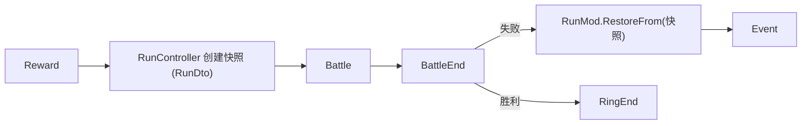

# 局内数据模块 (Run Mod) 设计规范

## 概述

Run Mod 管理一次游戏流程（Run）中跨战斗、跨事件持续存在的所有数据和逻辑。采用怪物火车式循环模型：数轮事件/奖励 → 强力战斗 → 重复 2-3 环。

定位为 combat 模块的上层编排者，通过 MVC 模式组织，与项目现有的 `GlobalMod` 架构保持一致。

---

## 1. 模块结构与架构

### 目录结构

```
Src/mod/run/
├── RunMod.cs                  # Run级数据持有（继承 BaseMod）
├── RunController.cs           # Run生命周期编排（继承 BaseController<RunMod>）
├── RunDto.cs                  # 可序列化的 Run 快照（存档用）
├── PlayerRunState.cs          # 每个槽位的玩家私有数据
├── PlayerRunStateDto.cs       # PlayerRunState 的可序列化快照
├── RunConstants.cs            # Run常量（上阵上限、奖励数量等）
├── ERunPhase.cs               # Run阶段枚举
│
├── save/
│   └── RunSaveService.cs      # Run存档的序列化/反序列化
│
├── reward/
│   └── RunRewardDistributor.cs # 奖励分发逻辑
│
└── events/
    └── RunEventBus.cs          # Run级事件定义
```

### 核心类型关系

```
RunMod (BaseMod)
├── [共享] RunId, CurrentRing, MaxRing, Phase, RunSeed, IsMultiplayer, BattleHistory
├── [共享] CharacterPool ── List<CharacterInstance> ── 全队共享角色池
├── [共享] CardCollection ── HashSet<string> ── 全队共享卡牌收集
├── [单人] SharedGold ── int ── 仅单人模式使用，多人模式下忽略
├── PlayerControllers ── List<PlayerController> ── 房间内的人类玩家列表（单人含 1 个 local）
│        ├── PlayerId  ── 唯一标识
│        ├── DisplayName ── 显示名
│        └── IsOwner   ── 是否为房主
├── SlotOwnership ── Dictionary<int, string> ── slotIndex(0-3) → playerId
│        └── 必须保持 4 个槽位全部分配才能进入战斗
└── PlayerRunState[4] ── 按槽位索引（0-3），每槽位独立数据
         ├── ActiveCharacter ── 当前上阵角色（从共享池选取，null=未上阵）
         ├── Gold            ── 仅多人模式的该槽位金币（单人模式金币在 SharedGold）
         ├── Modifiers       ── 该槽位的 Run 修饰器列表
         └── EventFlags      ── 该槽位的事件标记

ActiveParty 是计算属性：
  PlayerRunState[0..3].ActiveCharacter   ── 全部4个必须非null才能进入战斗
```

**金币存储规则**：单人模式（`IsMultiplayer == false`）→ `RunMod.SharedGold`，全队共享。多人模式（`IsMultiplayer == true`）→ 每槽位 `PlayerRunState.Gold`，即使只有 1 名真实玩家也按多人规则。

**控制权与槽位数据的分离**：`SlotOwnership` 管理"谁在操作这个槽位"，`PlayerRunState` 管理"槽位的游戏数据"。一个人类玩家可以控制多个槽位，奖励按槽位发放。

### 架构关系

```
RunController (编排者)
├── → RunMod (数据持有)
├── → RunSaveService (持久化)
├── → RunRewardDistributor (奖励逻辑)
└── → CombatSimulationFactory.TryCreate() (创建战斗)

RunController 是 Run 的唯一对外入口，所有操作通过它进行。
```

---

## 2. Run 生命周期与阶段流转

### ERunPhase

```
Init        ── Run创建：奖励分发、初始化角色池和编队
Event       ── 事件阶段：展示事件选项、玩家选择
Reward      ── 奖励结算：事件选择结果生效、分发奖励
Battle      ── 战斗阶段：创建 CombatSimulation、战斗进行中
BattleEnd   ── 战斗结算：处理战斗结果、收集战利品
RingEnd     ── 环结束：判断进入下一环或结束Run
Finished    ── Run结束（终态，用于结算和成就判定）
```

### 阶段流转

```
Init → Event → Reward → Event → Reward → ... → Reward → Battle → BattleEnd
                                                                ├── 胜利 → RingEnd → Event / Finished
                                                                └── 失败 → 回滚快照 → Event

所有阶段均可通过 RunController.AbandonRun() 跳转到 Finished。
```

### 战斗失败回滚机制



- `RunController.StartBattle()` 调用时内部创建 `_battleSnapshot = RunMod.ToDto()`（纯内存操作）
- `RunController.EndBattle()` 检测到失败时执行 `RunMod.RestoreFrom(_battleSnapshot)` 回滚
- 战斗中消耗的金币、获得的卡牌等全部撤销
- 回滚后 Run 回到 Event 阶段，玩家可调整编队后重新战斗

### RunController 公开 API

```csharp
// 生命周期
RunDto CreateRun(HostRng rng, IReadOnlyList<CharacterDto> candidates, bool isMultiplayer);
RunDto LoadRun(RunDto dto);
RunDto AbandonRun();

// 队伍管理
// 角色池管理（全队共享）
bool AddToCharacterPool(CharacterInstance character);
bool RemoveFromCharacterPool(string instanceId);
// 编队（按槽位，从共享角色池中选择）
bool SetActiveCharacter(int slotIndex, int poolIndex);
bool UnsetActiveCharacter(int slotIndex);
// 卡牌收集（全队共享）
bool AddCard(string cardId);
bool RemoveCard(string cardId);
// 金币
int GetGold(int? slotIndex = null);                          // 单人传 null，多人传 slotIndex
bool SpendGold(int slotIndex, int amount);                   // 花费金币
bool AddGold(int slotIndex, int amount);                     // 获得金币（单人 slotIndex 忽略）
bool TransferGold(int fromSlot, int toSlot, int amount);     // 仅多人，需双方同意
// 校验
bool ValidateParty();                                         // 4个槽位全部非null

// 事件
void BeginEventPhase(int ringIndex, int eventIndex);
void SelectEventOption(int slotIndex, int optionIndex);
void ApplyEventRewards();

// 战斗
CombatSimulation StartBattle(GameDefinitionRegistry definitions, HostRng rng, int runSeed);
void EndBattle(CombatSimulation simulation, bool won);

// 流程控制
void NextRing();
bool HasNextRing();

// 控制权管理（联机用，仅非战斗阶段可主动调用）
bool AssignSlot(int slotIndex, string playerId);
void OnPlayerDisconnected(string playerId);
bool SwapSlotOwnership(int slotA, int slotB, string initiatorId, string targetId);
bool AllSlotsAssigned();
IReadOnlyList<int> GetSlotsForPlayer(string playerId);

// 持久化
void Save(RunSaveService saveService);
bool TryLoad(RunSaveService saveService, out RunDto dto);
```

---

## 3. 数据模型

### RunDto（可序列化快照）

```csharp
public sealed record RunDto
{
    // 标识
    public string RunId { get; init; }
    public int SchemaVersion { get; init; }
    public DateTime CreatedAt { get; init; }
    public DateTime UpdatedAt { get; init; }

    // 进度
    public int CurrentRing { get; init; }
    public int MaxRing { get; init; }
    public ERunPhase Phase { get; init; }
    public int RunSeed { get; init; }

    // 多人
    public bool IsMultiplayer { get; init; }
    public List<PlayerControllerDto> PlayerControllers { get; init; }  // 房间内人类玩家
    public Dictionary<int, string> SlotOwnership { get; init; }        // slotIndex→playerId

    // 全队共享
    public List<CharacterPoolEntryDto> CharacterPool { get; init; }    // 全队共享角色池
    public List<string> CardCollection { get; init; }                  // 全队共享卡牌收集
    public int SharedGold { get; init; }                               // 单人模式全队共享金币

    // 每槽位玩家私有数据（length=4，全队共享数据不在此处）
    public List<PlayerRunStateDto> PlayerStates { get; init; }

    // 共享历史
    public List<BattleRecordDto> BattleHistory { get; init; }
}
```

### PlayerControllerDto

```csharp
public sealed record PlayerControllerDto
{
    public string PlayerId { get; init; }
    public string DisplayName { get; init; }
    public bool IsOwner { get; init; }
}
```

### PlayerRunStateDto

```csharp
public sealed record PlayerRunStateDto
{
    public int? ActiveCharacterIndex { get; init; }    // 共享池中索引，null=未上阵
    public int Gold { get; init; }                     // 仅多人模式的槽位金币
    public List<RunModifierDto> Modifiers { get; init; }
    public Dictionary<string, object> EventFlags { get; init; }
}
```

### CharacterPoolEntryDto

```csharp
public sealed record CharacterPoolEntryDto
{
    public string DefinitionId { get; init; }
    public string InstanceId { get; init; }
    public List<DeckSnapshotDto> Decks { get; init; }
    public int CurrentDeckIndex { get; init; }
}

public sealed record DeckSnapshotDto
{
    public List<string> CardIds { get; init; }
}
```

### RunModifierDto

```csharp
public sealed record RunModifierDto
{
    public string ModifierId { get; init; }
    public float Value { get; init; }
    public string Source { get; init; }
}
```

### BattleRecordDto

```csharp
public sealed record BattleRecordDto
{
    public string BattleId { get; init; }
    public bool Won { get; init; }
    public int TurnsUsed { get; init; }
    public int DamageDealt { get; init; }
    public int DamageTaken { get; init; }
}
```

### RunConstants 常量

```csharp
public static class RunConstants
{
    public const int MaxPlayers = 4;
    public const int SlotCount = 4;
    public const int MaxSlotsPerPlayer = 4;
    public const int MinSlotsPerPlayer = 1;
}
```

### 关键设计决策

- **控制权与槽位数据分离**：`SlotOwnership` 管理"谁操作这个槽位"，`PlayerRunState` 管理槽位游戏数据。一个人类玩家可控制多个槽位。
- **CharacterPool 与 CardCollection 全队共享**：所有槽位共享同一角色池和卡牌收集。各槽位从中选择上阵角色和构建卡组。
- **进入战斗的硬约束**：`ActiveParty` 全部 4 个槽位的 `ActiveCharacter` 必须非 null，且所有槽位都已分配控制权（`AllSlotsAssigned() == true`）。
- **CardCollection vs Deck.CardIds**：CardCollection 是「全队获得的全部卡牌」，Deck.CardIds 是「编入当前卡组的卡牌」。CardCollection 决定哪些额外卡牌可用，Deck.CardIds 是子集。两者都需要存档以支持回滚。
- **ActiveParty 不单独存储**：由各 PlayerRunState 的 ActiveCharacter 拼合计算得出。
- **存档不存完整 CharacterInstance**：只存 DefinitionId + InstanceId + Decks，重建时通过定义ID加载角色自带卡牌，再恢复卡组。
- **SchemaVersion 预留迁移能力**：首版为 1。

---

## 4. RunSaveService

### 接口

```csharp
public sealed class RunSaveService
{
    public RunSaveService(string directoryPath, Action<string>? logWarning = null);
    public bool Exists { get; }
    public RunDto? LoadOrDefault();
    public void Save(RunDto dto);
    public void Delete();
}
```

### 文件布局

```
user_data/runs/
├── <run_id>.json         # 运行中的存档
├── <run_id>.bak.json     # 备份（原子替换保留）
└── <run_id>.tmp.json     # 临时文件
```

### 原子写策略

与 `GlobalSaveService` 一致：`临时文件写入 → File.Replace() 原子替换 → 旧文件变备份`。JSON 损坏时降级到备份文件。

### 快照与回滚

- `RunMod.ToDto()` — 完整导出当前状态为 `RunDto`
- `RunMod.RestoreFrom(RunDto)` — 从快照恢复
- 战斗前快照为内存中的 `RunDto` 对象，不写磁盘
- 存档仅通过 `RunController.Save()` 触发，在关键阶段切换间隙自动调用

---

## 5. 奖励系统 (RunRewardDistributor)

### 接口

```csharp
public sealed class RunRewardDistributor
{
    // 创建Run时的初始角色奖励
    public CharacterSelectionResult SelectInitialCharacters(
        IReadOnlyList<CharacterDto> candidatePool, int pickCount, HostRng rng);

    // 为所有有数据的槽位各生成一份奖励（数量一致）
    public PerPlayerRewardSet GenerateRewards(
        IReadOnlyList<PlayerRunState?> playerStates,
        GameDefinitionRegistry definitions,
        int ringIndex,
        int optionCount,
        HostRng rng);

    // 应用单个玩家选择
    public void ApplyReward(PlayerRunState player, RewardOptionsDto options, int selectedIndex);
}
```

### 奖励类型与归属

| 奖励类型 | 归属 | 说明 |
|---|---|---|
| Character | 全队共享 CharacterPool | 获得新角色加入共享池，所有槽位都可选用 |
| Card | 全队共享 CardCollection | 获得卡牌加入共享收集 |
| Gold | 单人：SharedGold / 多人：槽位独立 | 单人全队共享，多人各自独立管理 |
| Modifier | 槽位独立 | 每个槽位独立管理 Run 修饰器 |
| Heal | 战斗内生效 | 回复效果在战斗创建时注入 |

### 公平性保证

单人和多人模式统一：遍历 `PlayerStates` 中有数据的槽位，每个槽位独立生成相同数量的奖励选项。各槽位使用独立的 RNG 子种子（`rng.Fork("reward.p{slot}")`），保证随机独立。

- 单人：遍历 4 个槽位，每个 1 份奖励 = 4 份
- 3 人联机：遍历 3 个有数据的槽位，每个 1 份 = 3 份

### RunModifier 在战斗中的生效

`RunController.StartBattle()` 收集所有有数据槽位的 Modifiers，汇总为 `Dictionary<string, float>`，传入 `CombatSimulationFactory.TryCreate()`：

```
RunController.StartBattle()
├── 遍历 PlayerStates，汇总各槽位的 Modifiers
├── CombatSimulationFactory.TryCreate(
│       party: ActiveParty,
│       runSeed: RunSeed,
│       runModifierValues: { modifierId → sum },
│       ...)
└── CombatSimulation 创建时将 modifier 注入到玩家 ASC
```

修饰器在战斗创建时「冻结」为数值快照，战斗期间 Run 数据变化不影响已创建的 CombatSimulation。

### RunRewardDistributor 是纯工具类

不持有状态，接收 `RunMod` 或 `PlayerRunState` 引用进行读写。奖励随机性由外部 `HostRng` 控制。

---

## 6. RunController 内部状态机

### 私有字段

```csharp
public sealed class RunController : BaseController<RunMod>
{
    private RunRewardDistributor _rewardDistributor;
    private RunDto? _battleSnapshot;      // 战斗前快照
    private CombatSimulation? _simulation; // 当前战斗引用
}
```

### 控制权管理方法内部逻辑

**AssignSlot（仅房主可调用，非战斗阶段）：**
1. 检查 Phase 不是 Battle/BattleEnd
2. 检查 playerId 在 PlayerControllers 中存在
3. `SlotOwnership[slotIndex] = playerId`

**OnPlayerDisconnected（网络层调用）：**
1. 非战斗阶段：`UnassignOwnedSlots(playerId)` 清空该玩家所有槽位
2. 战斗中且 playerId 是房主：本客户端执行 `AbandonRun()`
3. 战斗中且 playerId 非房主：所有槽位转移给房主（`SlotOwnership[slot] = ownerId`）
4. 被踢出/掉线的客户端自身也应执行 `AbandonRun()`

**SwapSlotOwnership（非战斗阶段，需双方同意）：**
1. 检查 Phase 不是 Battle/BattleEnd
2. 检查两个槽位当前控制者与参数匹配
3. 交换 `SlotOwnership[slotA]` 与 `SlotOwnership[slotB]`
```

### 关键方法内部逻辑

**CreateRun：**
1. `RunId = Guid.NewGuid()`
2. `RunSeed = rng.NextInt()`
3. 单人：创建 1 个 `PlayerController`（"local", IsOwner=true），`SlotOwnership` 4 槽位全指向 "local"
4. 多人：房主分配各槽位控制权，`SlotOwnership` 必须覆盖全部 4 个槽位
5. `RunRewardDistributor.SelectInitialCharacters()` 为共享角色池随机角色
6. 每个槽位的 `ActiveCharacterIndex` 由玩家从共享池中选择
7. `Phase = Event`，`CurrentRing = 1`

**StartBattle：**
1. `AllSlotsAssigned()` 检查 — 存在未分配槽位则拒绝
2. `ValidateParty()` — 全部 4 个槽位的 `ActiveCharacter` 必须非 null
3. `_battleSnapshot = Model.ToDto()` — 保存快照
4. 创建 `CombatSimulation`
5. `Phase = Battle`

**EndBattle：**
1. `_simulation.Dispose()`
2. 胜利：收集战利品 → 共享 `CardCollection` 更新、各槽位独立数据（Gold/Modifiers/EventFlags）更新，`Phase = RingEnd`
3. 失败：`Model.RestoreFrom(_battleSnapshot)`，`Phase = Event`

**AbandonRun：**
1. 如果有活跃的 `_simulation`，先 `Dispose()` 并丢弃战斗结果（不回滚）
2. `Phase = Finished`
3. 网络层监听 Phase 变化后通知其他客户端（房主掉线场景）

---

## 7. 多人与控制权管理

### 控制权模型

- 最多 4 人联机，固定 4 个游戏槽位
- 房主有权分配每个槽位的控制权给任意玩家
- 一人可控制多个槽位（如 2 人对战时每人控制 2 槽位）
- 奖励按槽位发放（控制多槽位 = 获得多份奖励）

### 阶段约束

| 场景 | 规则 |
|---|---|
| 进入战斗前 | 必须 `AllSlotsAssigned() == true`（4 个槽位全部分配） |
| 战斗中 | 主动控制权变更（分配/交换）不允许 |
| 战斗中 | 新玩家不可加入 |
| 非战斗阶段 | 房主可随时重新分配控制权 |
| 非战斗阶段 | 玩家可主动退出或被踢出 |
| 非战斗阶段 | 交换控制权需双方同意 |
| 非战斗阶段 | 金币转移/索取需双方同意（仅多人模式） |

### 金币规则

| 模式 | 存储位置 | 规则 |
|---|---|---|
| 单人（`IsMultiplayer == false`） | `RunMod.SharedGold` | 全队共享，不区分槽位 |
| 多人（`IsMultiplayer == true`） | 每槽位 `PlayerRunState.Gold` | 各自独立，可互相转移/索取（需双方同意） |
| 多人但仅 1 名真实玩家 | 同上 | 按多人规则，允许 1 人控制多槽位并自行分配金币 |

### 掉线/退出处理（由网络层调用 OnPlayerDisconnected）

| 场景 | 掉线者客户端 | 房主客户端 | 其他客户端 |
|---|---|---|---|
| 非房主掉线（非战斗） | `AbandonRun()` | 空出槽位，可重新分配 | 无变化 |
| 非房主掉线（战斗中） | `AbandonRun()` | 接管该玩家所有槽位 | 无变化 |
| 房主掉线（任何阶段） | `AbandonRun()` | `AbandonRun()` | `AbandonRun()` |

### 多人 RPC 通信

- 多人 RPC 通信不在本模块内处理，由上层（网络层）封装
- RunController 的 API 天然适合被 RPC 包装调用
- 网络层负责同步 `Phase / SlotOwnership / PlayerControllers` 变化到所有客户端
- 奖励随机性通过共享 `RunSeed` + 各槽位 `rng.Fork("reward.p{slot}")` 保证各客户端可独立算出相同结果

---

## 8. 与现有模块的对接点

| 对接点 | 说明 |
|---|---|
| `CombatSimulationFactory.TryCreate()` | 传入 ActiveParty + RunSeed + RunModifierValues 创建战斗。需要新增 `runModifierValues` 参数（`Dictionary<string, float>`），在 CombatSimulation 创建时注入玩家 ASC |
| `CharacterInstance` | 角色池成员类型，已完整支持定义绑定和卡组管理 |
| `GlobalSaveService` | RunSaveService 复用其原子写模式 |
| `BaseMod / BaseController` | 继承项目 MVC 基础框架 |
