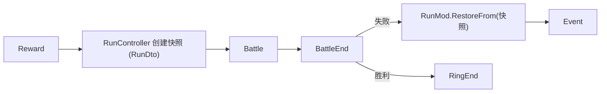

# 局内数据模块 (Run Mod) 设计规范

**日期**：2026-06-22
**最后修订**：2026-09-24（新增 §14 战斗界面 `CombatWin`）
**状态**：已实装（`Src/mod/run/`，`RunMod.FeatureId = "run"`）
**关系**：服从 [2026-05-11 总规格](2026-05-11-kemo-card-design.md)（玩法边界权威）；战斗相关服从 [2026-07-21 战斗规格](2026-07-21-combat-system-design.md)；内容定义见 [2026-05-17 内容 Mod 管理器规格](2026-05-17-content-mod-manager-design.md)；界面层遵循 [2026-05-15 UI 管理器规格](2026-05-15-ui-manager-design.md)、[2026-09-15 ui-mod-binding 规格](2026-05-15-ui-manager-design.md)、[2026-09-19 UI 主题规格](2026-09-21-global-mod-design.md) 与 [2026-09-21 羊皮纸重设计](2026-09-21-global-mod-design.md)。
**范围**：Run 域功能 Mod（`Src/mod/run/`，`RunMod.FeatureId = "run"`）的**唯一权威规格** —— 模块结构与架构、生命周期与阶段流转、数据模型与存档 schema、奖励分发、控制权与联机边界、Run 界面流程、存档闭环、ESC 系统菜单、队伍编辑界面、团体潜能（团队池 + 槽位直充 + 消费流水账本）。
**非范围**：战斗规则（阶段机 / SharedHp / 伤害与治疗公式 / 连携 / 槽位效果 / Buff 运行时）归 [2026-07-21 战斗规格](2026-07-21-combat-system-design.md) 与 [2026-09-19 Buff 运行时规格](2026-07-21-combat-system-design.md) §1–§3、§5–§7；**词典（Glossary）**界面与词条目录归 Global 功能规格（其源规格见 `Doc/superpowers/specs/2026-09-21-pause-menu-and-glossary-design.md` 的词典章节）；UI 管理器与场景约定归 [2026-05-15 UI 管理器规格](2026-05-15-ui-manager-design.md)；Toast 组件本身归 [2026-08-04 Toast 组件规格](2026-09-21-global-mod-design.md)。

## 本文承载的下级规格（2026-09-21 合并并归档）

下列**已实装**的 Run 域下级规格已整篇（或按注明范围）并入本文，不再单独维护；原件归档至 `Doc/archive/superpowers/specs/<同名文件>`。被并入章节的标题均保留其**原段号**标注（形如「（原 §3）」），使 `Src/` 与 `Doc/` 中按段号引用规格的注释继续可定位。

| 下级规格（原件） | 归档路径 | 并入本文 |
|---|---|---|
| `2026-08-04-run-save-continue-design.md`（整篇） | `Doc/archive/superpowers/specs/2026-08-04-run-save-continue-design.md` | §10（原 §1–§9） |
| `2026-09-21-pause-menu-and-glossary-design.md`（**仅 ESC 系统菜单部分**；词典部分另归 Global 功能规格） | `Doc/archive/superpowers/specs/2026-09-21-pause-menu-and-glossary-design.md` | §11（原 §1 目标 1–2、§2、§4 的 ESC 部分、§5 的 ESC / 退出边界） |
| `2026-09-21-run-team-editor-design.md`（整篇） | `Doc/archive/superpowers/specs/2026-09-21-run-team-editor-design.md` | §12（原 §1–§8） |
| `2026-09-19-buff-potential-chain-system-design.md`（**仅 §4 团体潜能**；§1/§2/§3/§5/§6/§7 归战斗规格） | `Doc/archive/superpowers/specs/2026-09-19-buff-potential-chain-system-design.md` | §13（原 §4 与 §4.1–§4.3） |

> **段号约定**：本文既有 §1–§9 的段号**保持不变**（`Src/` 与 `Doc/` 存在按段号引用本文的注释，例如 `run-mod-design §5`），因此本次并入的四个下级规格以**追加**方式编号为 §10–§13；各小节括号内标注原规格段号。

---

## 概述

Run Mod 管理一次游戏流程（Run）中跨战斗、跨事件持续存在的所有数据和逻辑。采用怪物火车式循环模型：数轮事件/奖励 → 强力战斗 → 重复 2-3 环（环数等可由故事脚本白名单覆盖，见总规格）。

定位为 combat 模块的上层编排者，通过 MVC 模式组织，与项目现有的 `GlobalMod` 架构保持一致。

> **权威冲突**：玩法边界以 [2026-05-11-kemo-card-design.md](./2026-05-11-kemo-card-design.md) 为准。下文若与总规格冲突（尤其奖励分发、CardCollection 语义、开局角色、潜能/被动、SharedHp 生命周期、修饰归属），以总规格为准并以下文「已对齐」段落为准。

---

## 1. 模块结构与架构

### 目录结构

```
Src/mod/run/
├── RunMod.cs                  # Run级数据持有（继承 BaseMod）
├── RunController.cs           # Run生命周期编排（继承 BaseController<RunMod>）
├── RunRuntime.cs              # 当前 Run 会话门面（CreateNew / Abandon）
├── RunDto.cs                  # 可序列化的 Run 快照（存档用）
├── PlayerRunState.cs          # 每个槽位的玩家私有数据
├── PlayerRunStateDto.cs       # PlayerRunState 的可序列化快照
├── RunConstants.cs            # Run常量（上阵上限、奖励数量等）
├── ERunPhase.cs               # Run阶段枚举
│
├── save/
│   └── RunSaveService.cs      # Run存档的序列化/反序列化
│
├── reward/
│   └── RunRewardDistributor.cs # 奖励分发逻辑
│
├── Ui/
│   ├── StorySelectDlg.cs/.tscn  # 选故事界面（Dialog）
│   └── RunMainWin.cs/.tscn      # Run 主界面（Window 壳）
│
└── events/
    └── RunEventBus.cs          # Run级事件定义
```

### 核心类型关系

```
RunMod (BaseMod)
├── [共享] RunId, StoryId, CurrentRing, MaxRing, Phase, RunSeed, IsMultiplayer
├── [共享] ExperiencedBattles / ExperiencedEvents ── 账本（去重用，见总规格 4.3）
├── [共享] BattleHistory ── 战斗统计（与账本分离，失败也可记录，不参与去重）
├── [共享] CharacterPool ── List<CharacterInstance> ── 全队共享角色池（定义唯一；含潜能解放）
├── [共享] CardCollection ── HashSet<string> ── 全队共享卡牌收集
├── [单人] SharedGold ── int ── 仅单人模式使用，多人模式下忽略
├── [单人] SharedModifiers ── List<RunModifier> ── 单人共享 Run 修饰（联机用槽位 Modifiers）
├── PlayerControllers ── List<PlayerController> ── 房间内的人类玩家列表（单人含 1 个 local）
│        ├── PlayerId  ── 唯一标识
│        ├── DisplayName ── 显示名
│        └── IsOwner   ── 是否为房主
├── SlotOwnership ── Dictionary<int, string> ── slotIndex(0-3) → playerId
│        └── 必须保持 4 个槽位全部分配才能进入战斗
└── PlayerRunState[4] ── 按槽位索引（0-3），每槽位独立数据
         ├── ActiveCharacter ── 当前上阵角色（从共享池选取，null=未上阵）
         ├── Gold            ── 仅多人模式的该槽位金币（单人模式金币在 SharedGold）
         ├── Modifiers       ── 仅多人：该槽位的 Run 修饰器列表
         └── EventFlags      ── 该槽位的事件标记

ActiveParty 是计算属性：
  PlayerRunState[0..3].ActiveCharacter   ── 全部4个必须非null才能进入战斗
```

**金币存储规则**：单人模式（`IsMultiplayer == false`）→ `RunMod.SharedGold`，全队共享。多人模式（`IsMultiplayer == true`）→ 每槽位 `PlayerRunState.Gold`，即使只有 1 名真实玩家也按多人规则。

**控制权与槽位数据的分离**：`SlotOwnership` 管理"谁在操作这个槽位"，`PlayerRunState` 管理"槽位的游戏数据"。一个人类玩家可以控制多个槽位。奖励分发：联机绑槽；单人走细粒度共享层（见 §5，不以「每槽一份」为单人权威）。

### 架构关系

```
RunController (编排者)
├── → RunMod (数据持有)
├── → RunSaveService (持久化)
├── → RunRewardDistributor (奖励逻辑)
└── → CombatSimulationFactory.TryCreate() (创建战斗)

RunController 是 Run 的唯一对外入口，所有操作通过它进行。
```

---

## 2. Run 生命周期与阶段流转

### ERunPhase

```
Init        ── Run创建：奖励分发、初始化角色池和编队
Event       ── 事件阶段：展示事件选项、玩家选择
Reward      ── 奖励结算：事件选择结果生效、分发奖励
Battle      ── 战斗阶段：创建 CombatSimulation、战斗进行中
BattleEnd   ── 战斗结算：处理战斗结果、收集战利品
RingEnd     ── 环结束：判断进入下一环或结束Run
Finished    ── Run结束（终态，用于结算和成就判定）
```

### 阶段流转

```
Init → Event → Reward → Event → Reward → ... → Reward → Battle → BattleEnd
                                                                ├── 胜利 → RingEnd → Event / Finished
                                                                └── 失败 → 回滚快照 → Event

所有阶段均可通过 RunController.AbandonRun() 跳转到 Finished。
```

### 战斗失败回滚机制



- `RunController.StartBattle()` 调用时内部创建 `_battleSnapshot = RunMod.ToDto()`（纯内存操作）
- `RunController.EndBattle()` 检测到失败时执行 `RunMod.RestoreFrom(_battleSnapshot)` 回滚
- 战斗中消耗的药水/金币、修饰 charges、临时获得等 **全部撤销**（总规格：失败 = 纯时间成本，完整快照回滚）
- 回滚后 Run 回到 Event 阶段，玩家可调整编队后重新战斗；无失败资源税、可无限重试

### RunController 公开 API

```csharp
// 生命周期（storyId 必选：Run 开始前必须选定故事脚本，总规格 4.1）
RunDto CreateRun(string storyId, HostRng rng, IReadOnlyList<CharacterDto> candidates, bool isMultiplayer);
RunDto LoadRun(RunDto dto);
RunDto AbandonRun();

// 队伍管理
// 角色池管理（全队共享）
bool AddToCharacterPool(CharacterInstance character);
bool RemoveFromCharacterPool(string instanceId);
// 编队（按槽位，从共享角色池中选择）
bool SetActiveCharacter(int slotIndex, int poolIndex);
bool UnsetActiveCharacter(int slotIndex);
// 卡牌收集（全队共享）
bool AddCard(string cardId);
bool RemoveCard(string cardId);
// 金币
int GetGold(int? slotIndex = null);                          // 单人传 null，多人传 slotIndex
bool SpendGold(int slotIndex, int amount);                   // 花费金币
bool AddGold(int slotIndex, int amount);                     // 获得金币（单人 slotIndex 忽略）
bool TransferGold(int fromSlot, int toSlot, int amount);     // 仅多人，需双方同意
// 校验
bool ValidateParty();                                         // 4个槽位全部非null

// 事件
void BeginEventPhase(int ringIndex, int eventIndex);
void SelectEventOption(int slotIndex, int optionIndex);
void ApplyEventRewards();

// 战斗
CombatSimulation StartBattle(GameDefinitionRegistry definitions, HostRng rng, int runSeed);
void EndBattle(CombatSimulation simulation, bool won);

// 流程控制
void NextRing();
bool HasNextRing();

// 控制权管理（联机用，仅非战斗阶段可主动调用）
bool AssignSlot(int slotIndex, string playerId);
void OnPlayerDisconnected(string playerId);
bool SwapSlotOwnership(int slotA, int slotB, string initiatorId, string targetId);
bool AllSlotsAssigned();
IReadOnlyList<int> GetSlotsForPlayer(string playerId);

// 持久化
void EnableAutoSave(RunSaveService saveService);   // 注入自动保存（实现修订 2026-08-04，完整闭环见 §10）
void Save(RunSaveService saveService);
bool TryLoad(RunSaveService saveService, out RunDto dto);
```

---

## 3. 数据模型

### RunDto（可序列化快照）

```csharp
public sealed record RunDto
{
    // 标识
    public string RunId { get; init; }
    public string StoryId { get; init; }               // Run 开始前必选的故事脚本 id（总规格 4.1）
    public int SchemaVersion { get; init; }
    public DateTime CreatedAt { get; init; }
    public DateTime UpdatedAt { get; init; }

    // 进度
    public int CurrentRing { get; init; }
    public int MaxRing { get; init; }
    public ERunPhase Phase { get; init; }
    public int RunSeed { get; init; }
    public string RngStreamState { get; init; }        // 宿主 RNG 流状态（可复现，总规格 5.3.1）

    // 多人
    public bool IsMultiplayer { get; init; }
    public List<PlayerControllerDto> PlayerControllers { get; init; }  // 房间内人类玩家
    public Dictionary<int, string> SlotOwnership { get; init; }        // slotIndex→playerId

    // 全队共享
    public List<CharacterPoolEntryDto> CharacterPool { get; init; }    // 全队共享角色池
    public List<string> CardCollection { get; init; }                  // 全队共享卡牌收集
    public int SharedGold { get; init; }                               // 单人模式全队共享金币
    public List<RunModifierDto> SharedModifiers { get; init; }         // 单人共享 Run 修饰（总规格 4.7）

    // 账本（去重用，总规格 4.3；仅不可逆提交点写入）
    public List<string> ExperiencedBattles { get; init; }              // 已胜利入账的战斗定义 id
    public List<string> ExperiencedEvents { get; init; }               // 已生效入账的事件定义 id

    // 当前阶段未提交的选项（若存在；事件/奖励选项刷新后尚未生效时随档保存，总规格 5.3.1）
    public PendingChoiceDto? PendingChoice { get; init; }

    // 每槽位玩家私有数据（length=4，全队共享数据不在此处）
    public List<PlayerRunStateDto> PlayerStates { get; init; }

    // 共享历史（纯统计，与账本分离；失败也可记录，不参与去重）
    public List<BattleRecordDto> BattleHistory { get; init; }

    // 诊断（总规格 5.3.1：加载不一致须提示风险）
    public Dictionary<string, string> DefinitionVersions { get; init; } // 各管理器内容版本/哈希摘要
}
```

### PlayerControllerDto

```csharp
public sealed record PlayerControllerDto
{
    public string PlayerId { get; init; }
    public string DisplayName { get; init; }
    public bool IsOwner { get; init; }
}
```

### PlayerRunStateDto

```csharp
public sealed record PlayerRunStateDto
{
    public int? ActiveCharacterIndex { get; init; }    // 共享池中索引，null=未上阵
    public int Gold { get; init; }                     // 仅多人模式的槽位金币
    public List<RunModifierDto> Modifiers { get; init; }
    public Dictionary<string, object> EventFlags { get; init; }
}
```

### CharacterPoolEntryDto

```csharp
public sealed record CharacterPoolEntryDto
{
    public string DefinitionId { get; init; }
    public string InstanceId { get; init; }
    public int PotentialLiberation { get; init; } // 潜能解放 [0,100]；重复角色 +20 后 clamp
    public List<DeckSnapshotDto> Decks { get; init; }
    public int CurrentDeckIndex { get; init; }
}

public sealed record DeckSnapshotDto
{
    public List<string> CardIds { get; init; }
}
```

> **2026-09-21 合并（来源冲突）**：`PotentialLiberation`（整数潜能 [0,100] + 六档阈值）属**已被取代**的旧模型，实装已改为 **团队池 + 槽位直充 + 消费流水账本**，见 §13；该字段在 `Src/mod/run/RunDto.cs` 中已不存在（现行 `CharacterPoolEntryDto` 为 `DefinitionId / InstanceId / DefinitionCardIds / Decks / CurrentDeckIndex`）。

### RunModifierDto

> **已对齐总规格 4.7**：修饰是开战技能引用 + charges，不再是 float 数值袋。

```csharp
public sealed record RunModifierDto
{
    public string ModifierId { get; init; }   // 稳定 id（内容/诊断）
    public string SkillId { get; init; }      // 开战释放的技能引用
    public int Charges { get; init; }         // <=0（-1 或 0）常驻；>=1 消耗型
    public string Source { get; init; }
}
```

### BattleRecordDto

```csharp
public sealed record BattleRecordDto
{
    public string BattleId { get; init; }
    public bool Won { get; init; }
    public int TurnsUsed { get; init; }
    public int DamageDealt { get; init; }
    public int DamageTaken { get; init; }
}
```

### PendingChoiceDto

```csharp
public sealed record PendingChoiceDto
{
    public string SourceId { get; init; }        // 产生选项的事件/奖励来源定义 id
    public List<string> OptionIds { get; init; } // 已刷新但未生效的选项（不入账本，可再次出现）
}
```

### RunConstants 常量

```csharp
public static class RunConstants
{
    public const int MaxPlayers = 4;
    public const int SlotCount = 4;
    public const int MaxSlotsPerPlayer = 4;
    public const int MinSlotsPerPlayer = 1;
    public const int DefaultSoloRewardCountK = 3; // 单人每次 Reward 细粒度次数；故事可覆盖
    public const int PotentialPerDuplicate = 20;
    public const int MaxPotentialLiberation = 100;
}
```

> **2026-09-21 合并（来源冲突）**：`PotentialPerDuplicate = 20` / `MaxPotentialLiberation = 100` 属旧「整数潜能 + 六档阈值」模型的遗留常量；「重复获得角色 **+20**」的数额仍有效，但**去向**已改（入团队池，或重复的是本槽已有角色时直充该槽位），且不再有 `clamp 100` 与「满 100 移出投放池」规则，见 §13.1 / §13.2。

### 关键设计决策

- **控制权与槽位数据分离**：`SlotOwnership` 管理"谁操作这个槽位"，`PlayerRunState` 管理槽位游戏数据。一个人类玩家可控制多个槽位。
- **CharacterPool 与 CardCollection 全队共享**：所有槽位共享同一角色池和卡牌收集。各槽位从中选择上阵角色和构建卡组。开局无预置池：由每槽角色 3 选 1（**硬去重**）与中途奖励填充（总规格 4.5）。
- **角色定义唯一 + 潜能**：池内同一定义最多 1 实例；重复获得 → `PotentialLiberation += 20`（clamp 100）；满 100 移出随机角色投放池；满后再重复静默吞掉。被动为潜能六档解锁的自动技能，首发仅 BattleStart 触发。
  > **2026-09-21 合并（来源冲突）**：本条的「`PotentialLiberation += 20`（clamp 100）／满 100 移出随机角色投放池／被动为潜能六档解锁」是**已被取代**的旧表述；现行模型为团队池 + 槽位直充 + 消费流水账本，被动解锁判定 = 存在匹配 `(characterInstanceId, buffId)` 的流水记录（或 `requiredPotential == 0`），见 §13.1–§13.2。「角色定义唯一（重复定义不入第二实例）」与「满后再重复静默吞掉」仍然有效。
- **进入战斗的硬约束**：`ActiveParty` 全部 4 个槽位的 `ActiveCharacter` 必须非 null，且所有槽位都已分配控制权（`AllSlotsAssigned() == true`）；每槽卡组须通过总规格 4.6 校验（1–10 张、专属/`ERole`、升级链最高阶、每 id≤1）。
- **CardCollection vs Deck.CardIds**：`CardCollection` 是 **解锁/配方**（可含升级链多阶 id），不是稀缺实体库存；`Deck.CardIds` 是「编入当前卡组」且须为收集上 **可编入最高阶** 的子集。链升阶时各卡组旧 id **自动替换**为新最高阶。两者都需要存档以支持回滚。换人仅环间/事件；战斗中不可换。
- **ActiveParty 不单独存储**：由各 PlayerRunState 的 ActiveCharacter 拼合计算得出。
- **存档不存完整 CharacterInstance**：只存 DefinitionId + InstanceId + PotentialLiberation + Decks，重建时通过定义ID加载角色自带卡牌，再恢复卡组与潜能。
  > **2026-09-21 合并（实现修订）**：读档重建角色实例时须按 `definitionId` 从**内容注册表**取回完整定义（显示名 / 元素 / 种族 / 职业 / 能量 / 被动），取不到才回落到存档内的最小快照；`RunMod.RestoreFrom` 接受 `definitionResolver`，见 §12.7。存档字段侧同时以 `DefinitionCardIds` 承载角色定义自带卡牌。
- **SchemaVersion 预留迁移能力**：首版为 1；**2026-09-21 起当前版本为 v2**（新增团体潜能池与每槽位潜能账本），`RunDto.Normalize()` 负责 v1 → v2 迁移，见 §13.4。

---

## 4. RunSaveService

### 接口

```csharp
public sealed class RunSaveService
{
    public RunSaveService(string directoryPath, Action<string>? logWarning = null);
    public bool Exists { get; }
    public RunDto? LoadOrDefault();
    public void Save(RunDto dto);
    public void Delete();
}
```

### 文件布局

```
user_data/saves/run/          # 运行时接线目录（RunRuntime 静态持有）
├── <run_id>.json         # 运行中的存档
├── <run_id>.bak.json     # 备份（原子替换保留）
└── <run_id>.tmp.json     # 临时文件
```

> 实现修订（2026-08-04）：目录为 `user://saves/run`（`RunRuntime` 懒加载 `SaveService`），与全局存档 `user://saves` 分离。存储模型与接线细节见 §10.2 / §10.3。

### 原子写策略

与 `GlobalSaveService` 一致：`临时文件写入 → File.Replace() 原子替换 → 旧文件变备份`。JSON 损坏时降级到备份文件。

### 单槽存档语义

- `RunRuntime.SaveService`：单槽覆盖写，同一时刻只有最近一局有效。
- 新 Run（`RunRuntime.CreateNew`）先删旧档再建新 run，避免旧 RunId 文件残留。
- `RunRuntime.Abandon()` 连带删档，「继续游戏」不再指向已放弃的档。

### 快照与回滚

- `RunMod.ToDto()` — 完整导出当前状态为 `RunDto`
- `RunMod.RestoreFrom(RunDto)` — 从快照恢复
- 战斗前快照为内存中的 `RunDto` 对象，不写磁盘
- 存档仅通过 `RunController.Save()` 触发，在关键阶段切换间隙自动调用

> **2026-09-21 合并（实现修订）**：`RunMod.RestoreFrom` 现接受 `definitionResolver`（按 `definitionId` 从内容注册表取回完整角色定义），`RunController` 的 `LoadRun` / `LoadFromSave` / 战斗快照回滚三条路径都会带上它，见 §12.7。

### 自动保存（grilling 决议 2026-08-04）

- `RunController.EnableAutoSave(RunSaveService)` 注入自动保存服务。
- 阶段切换点（`CreateRun` / `NextRing` / `EndBattle` 胜利分支）调用 `AutoSaveIfSettled()`；**战斗中（Battle/BattleEnd）不落盘；战斗失败不做自动保存**（存档保持战前状态）。
- 静默：自动保存不弹 Toast。
- 退出前：`RunMainWin.OnClose()` 中若非战斗且非 Finished 再存一次；放弃走删档。

> 本节与 §10.4 同源（2026-08-04 存档闭环规格 §4），规则一致、无冲突；完整闭环（按钮布局、MenuWin 接线、翻译键、边界与异常）以 §10 为准。

---

## 5. 奖励系统 (RunRewardDistributor)

### 接口

```csharp
public sealed class RunRewardDistributor
{
    // 创建Run时的初始角色奖励
    public CharacterSelectionResult SelectInitialCharacters(
        IReadOnlyList<CharacterDto> candidatePool, int pickCount, HostRng rng);

    // 单人路径：一次 Reward 生成 K 次细粒度奖励（不绑槽，进共享层；K 默认 3，可被故事覆盖）
    public SoloRewardSet GenerateSoloRewards(
        RunMod run,
        GameDefinitionRegistry definitions,
        int ringIndex,
        int rewardCount,   // = K
        HostRng rng);

    // 联机路径：为所有有数据的槽位各生成一份奖励（绑槽分发，数量一致）
    public PerPlayerRewardSet GenerateRewards(
        IReadOnlyList<PlayerRunState?> playerStates,
        GameDefinitionRegistry definitions,
        int ringIndex,
        int optionCount,
        HostRng rng);

    // 应用单个玩家选择
    public void ApplyReward(PlayerRunState player, RewardOptionsDto options, int selectedIndex);
}
```

### 奖励类型与归属

| 奖励类型 | 归属 | 说明 |
|---|---|---|
| Character | 全队共享 CharacterPool | 新人入池（潜能 0）+ 初始卡写入；重复 → 潜能 +20；满 100 移出随机池；满后再重复静默（总规格 4.5） |
| Card | 全队共享 CardCollection | 投放链 **最低 id**；重复则链升级并 **自动替换卡组**；满级移出投放池（总规格 4.6） |
| Gold | 单人：SharedGold / 多人：槽位独立 | 首发仍投放；花费面见商店·道具规格；落地前默认不可耗尽 |
| Modifier | 单人：SharedModifiers / 联机：槽位 Modifiers | 技能引用 + charges；单人共享；联机绑槽（总规格 4.7） |
| Heal | **已废除** | 非战斗无 SharedHp；开战恒满血。战前增益改用修饰或开战技能 |
| Potion/Item | 外移商店·道具规格 | 总规格仅占位；若已实装则失败回滚含其状态 |

> **2026-09-21 合并（来源冲突）**：上表 Character 行的「重复 → 潜能 +20；满 100 移出随机池」中的**去向与满值规则**已由 §13（团队池 + 槽位直充 + 消费流水账本，不再有 100 上限与移池规则）取代；「+20」数额与「重复获得同一**定义**不入第二实例」仍然有效。

### 分发策略（单人 / 联机分叉）

框架须支持两种策略切换（总规格 4.7）：

| 模式 | 策略 |
|---|---|
| 单人 | **不绑槽**：每次 Reward 默认 **K=3** 次细粒度奖励进入共享层（`CardCollection` / `SharedGold` / `SharedModifiers` 等）。K 可由故事白名单覆盖，**不以「每槽一份」为权威**。 |
| 联机 | **绑槽**：遍历有数据槽位各生成奖励；RNG 子种子 `rng.Fork("reward.p{slot}")`。 |

**Init 特例（单人/联机开局）**：每个槽位一次 **角色 3 选 1**（候选项 **硬去重** 已有/已选；池不足降为 2/1 选 1；凑不出 4 人 Fatal）；落选作废；选中进池并上阵。此为故事/Init 流程，不套用「单人常规不绑槽」否定开局按槽选人。

> 旧表述「单人遍历 4 槽各 1 份 = 4 份」已废弃；默认权威为 K=3。  
> **空 Reward**：单次细粒度抽取可发空；不强制用金币等类型凑满 K。

### RunModifier 在战斗中的生效

> **已对齐总规格 4.7 / 2.2**：废除「Dictionary 数值袋注入 ASC」。修饰在 BattleStart 经技能管线释放。

```
RunController.StartBattle()
├── 创建 CombatSimulation（party / runSeed / …；无 runModifierValues 数值袋）
├── BattleStart 自动技能（顺序写死）：
│       1) 被动：槽 0→3，同角色 requiredPotential 低→高
│       2) 修饰：单人 SharedModifiers（或联机各槽列表按宿主约定展开）按插入序
│          各尝试释放 SkillId 一次
└── 进入首个玩家阶段
```

- **charges 扣减**：仅在 **战斗胜利不可逆结算** 时对 `charges >= 1` 的条目 `-1`，结果 `< 1` 则移除；`charges <= 0` 常驻不扣。
- **失败回滚**：战前快照恢复修饰列表（含 charges），与药水/金币一致。

### RunRewardDistributor 是纯工具类

不持有状态，接收 `RunMod` 或 `PlayerRunState` 引用进行读写。奖励随机性由外部 `HostRng` 控制。

---

## 6. RunController 内部状态机

### 私有字段

```csharp
public sealed class RunController : BaseController<RunMod>
{
    private RunRewardDistributor _rewardDistributor;
    private RunDto? _battleSnapshot;      // 战斗前快照
    private CombatSimulation? _simulation; // 当前战斗引用
}
```

### 控制权管理方法内部逻辑

**AssignSlot（仅房主可调用，非战斗阶段）：**
1. 检查 Phase 不是 Battle/BattleEnd
2. 检查 playerId 在 PlayerControllers 中存在
3. `SlotOwnership[slotIndex] = playerId`

**OnPlayerDisconnected（网络层调用）：**
1. 非战斗阶段：`UnassignOwnedSlots(playerId)` 清空该玩家所有槽位
2. 战斗中且 playerId 是房主：本客户端执行 `AbandonRun()`
3. 战斗中且 playerId 非房主：所有槽位转移给房主（`SlotOwnership[slot] = ownerId`）
4. 被踢出/掉线的客户端自身也应执行 `AbandonRun()`

**SwapSlotOwnership（非战斗阶段，需双方同意）：**
1. 检查 Phase 不是 Battle/BattleEnd
2. 检查两个槽位当前控制者与参数匹配
3. 交换 `SlotOwnership[slotA]` 与 `SlotOwnership[slotB]`

### 关键方法内部逻辑

**CreateRun：**
1. `RunId = Guid.NewGuid()`；固化 `StoryId`（未提供合法故事脚本 id → 拒绝创建）
2. `RunSeed = rng.RunSeed`（`HostRng` 暴露构造时传入的 seed；**手写 seed 语义**：UI 用用户输入 seed 构造 `HostRng`，`>= 0` 原样落库；`-1` 随机时由上层以随机值构造）；记录定义版本摘要 `DefinitionVersions`
3. 单人：创建 1 个 `PlayerController`（"local", IsOwner=true），`SlotOwnership` 4 槽位全指向 "local"
4. 多人：房主分配各槽位控制权，`SlotOwnership` 必须覆盖全部 4 个槽位
5. 开局无预置 CharacterPool；按故事/Init 为 **每个槽位** 生成角色 **3 选 1**（硬去重；池不足降为 2/1；凑不出 4 人 Fatal；落选作废，不进池）
6. 选中角色入池（潜能 0）并设为该槽 `ActiveCharacter`；初始卡写入 `CardCollection` 并自动编入该角色卡组
7. `Phase = Event`，`CurrentRing = 1`

**StartBattle：**
1. `AllSlotsAssigned()` 检查 — 存在未分配槽位则拒绝
2. `ValidateParty()` — 全部 4 个槽位的 `ActiveCharacter` 必须非 null；卡组通过 4.6 校验
3. `_battleSnapshot = Model.ToDto()` — 保存快照
4. 创建 `CombatSimulation`；BattleStart：先被动后修饰（总规格 2.2 / 4.7）
5. `Phase = Battle`

**EndBattle：**
1. `_simulation.Dispose()`
2. 胜利：收集战利品 → 共享 `CardCollection` / 潜能 / 单人 SharedGold·SharedModifiers（charges 扣减；或联机槽数据）更新；**该战斗定义 id 写入 `ExperiencedBattles`**（不可逆入账，总规格 4.3），`Phase = RingEnd`
3. 失败：`Model.RestoreFrom(_battleSnapshot)`（完整回滚，含修饰 charges），**不写入账本**，`Phase = Event`

**账本写入（总规格 4.3）：**
- 战斗：仅胜利进入不可逆结算时写 `ExperiencedBattles`；失败回滚不入账，同战可再遇。
- 事件：选项真正生效（进入 Reward 且宿主不可逆提交，即 `ApplyEventRewards` 提交点）时写 `ExperiencedEvents`；仅刷新为选项未执行不入账。
- 卡牌 / 药水允许重复刷新，不进账本（升级链另按总规格 4.6）。

**AbandonRun：**
1. 如果有活跃的 `_simulation`，先 `Dispose()` 并丢弃战斗结果（不回滚）
2. `Phase = Finished`
3. 网络层监听 Phase 变化后通知其他客户端（房主掉线场景）

---

## 7. 多人与控制权管理

### 控制权模型

- 最多 4 人联机，固定 4 个游戏槽位
- 房主有权分配每个槽位的控制权给任意玩家
- 一人可控制多个槽位（如 2 人对战时每人控制 2 槽位）
- 联机奖励按槽位发放（控制多槽位 = 获得多份奖励）；单人见 §5 不绑槽策略

### 阶段约束

| 场景 | 规则 |
|---|---|
| 进入战斗前 | 必须 `AllSlotsAssigned() == true`（4 个槽位全部分配） |
| 战斗中 | 主动控制权变更（分配/交换）不允许 |
| 战斗中 | 新玩家不可加入 |
| 非战斗阶段 | 房主可随时重新分配控制权 |
| 非战斗阶段 | 玩家可主动退出或被踢出 |
| 非战斗阶段 | 交换控制权需双方同意 |
| 非战斗阶段 | 金币转移/索取需双方同意（仅多人模式） |

> **2026-09-21 合并（补充）**：除上表外，`Phase ∈ {Battle, BattleEnd, Finished}` 期间队伍编辑（上阵/下阵、卡组增删）同样被门闩禁止，见 §12.5；保存系按钮与「保存并退出」在 Battle / BattleEnd 阶段禁用，见 §10.5.3 与 §11.2。

### 金币规则

| 模式 | 存储位置 | 规则 |
|---|---|---|
| 单人（`IsMultiplayer == false`） | `RunMod.SharedGold` | 全队共享，不区分槽位 |
| 多人（`IsMultiplayer == true`） | 每槽位 `PlayerRunState.Gold` | 各自独立，可互相转移/索取（需双方同意） |
| 多人但仅 1 名真实玩家 | 同上 | 按多人规则，允许 1 人控制多槽位并自行分配金币 |

### 掉线/退出处理（由网络层调用 OnPlayerDisconnected）

| 场景 | 掉线者客户端 | 房主客户端 | 其他客户端 |
|---|---|---|---|
| 非房主掉线（非战斗） | `AbandonRun()` | 空出槽位，可重新分配 | 无变化 |
| 非房主掉线（战斗中） | `AbandonRun()` | 接管该玩家所有槽位 | 无变化 |
| 房主掉线（任何阶段） | `AbandonRun()` | `AbandonRun()` | `AbandonRun()` |

### 多人 RPC 通信

- 多人 RPC 通信不在本模块内处理，由上层（网络层）封装
- RunController 的 API 天然适合被 RPC 包装调用
- 网络层负责同步 `Phase / SlotOwnership / PlayerControllers` 变化到所有客户端
- 奖励随机性通过共享 `RunSeed` + 各槽位 `rng.Fork("reward.p{slot}")` 保证各客户端可独立算出相同结果

---

## 8. 与现有模块的对接点

| 对接点 | 说明 |
|---|---|
| `CombatSimulationFactory.TryCreate()` | 传入 ActiveParty + RunSeed 等创建战斗；**不再**传入 float 修饰数值袋。BattleStart 被动/修饰由 RunController 按总规格顺序经技能管线触发 |
| `CharacterInstance` | 角色池成员类型，已完整支持定义绑定和卡组管理 |
| `GlobalSaveService` | RunSaveService 复用其原子写模式 |
| `BaseMod / BaseController` | 继承项目 MVC 基础框架 |
| `GlobalModController` / 条件引擎 | 选故事时经 `GlobalPersistentCondContext` 求值 `StoryDto.unlock`（见条件规格 §8） |
| `UIManager` | 选故事（Dialog）与 Run 主界面（Window）经 `RunMod.GetUIRegistrations()` 注册 |

---

## 9. Run 界面流程（选故事 → 主界面）

| 步骤 | 界面 | 行为 |
|---|---|---|
| 1 | 主菜单「新游戏」 | 打开选故事 Dialog（`Src/mod/run/Ui/StorySelectDlg`） |
| 2 | 选故事 | 列表 = `GameDefinitionStore.Stories` 全量；按 `StoryDto.unlock` + Persistent 条件求值判定可玩；**未通过可选中预览详情，但确定按钮不可用**；右侧显示故事名 / 作者 / 所属 Mod（Registry owner）/ 模式（仅单人 / 可联机）/ 描述，未满足条件时显示条件提示 |
| 3 | 选故事 · Seed | 输入默认 `-1`（随机），`>= 0` 视为手写 seed（精确成为 `RunSeed`） |
| 4 | 确定 | `RunRuntime.CreateNew(storyId, seed, candidates)`（单人，`candidates` 暂空）→ 关闭选故事 → 打开 Run 主界面 Window（`RunMainWin`） |
| 5 | Run 主界面（壳） | 显示故事名、阶段、环/MaxRing、Seed、金币（单人 `SharedGold`）；右下角「保存 / 保存并返回主菜单 / 快速读取存档 / 放弃 Run」（实现修订 2026-08-04）；战斗中（Battle/BattleEnd）保存系按钮禁用；放弃 → 确认 Alert → `RunRuntime.Abandon()`（删档）→ 回主菜单 |
| 6 | 后置 | 环地图、事件 / 奖励 / 编队 / 战斗入口、开局选人：后续里程碑落地，不在本界面范围 |

- `RunRuntime`（`Src/mod/run/RunRuntime.cs`）为当前 Run 会话门面：持有 `RunController` 单例，`CreateNew` 销毁旧会话并构造新 `HostRng`。
- 运行期状态读取走 `RunRuntime.Current`，UI 不直接构造 `RunController`。
- **存档门面（实现修订 2026-08-04）**：`RunRuntime.SaveService` / `HasSave` / `SaveCurrent()` / `TryLoadLatest()` / `ClearSave()`；`CreateNew` 前删旧档并 `EnableAutoSave`；`Abandon` 删档。主菜单「继续游戏」（`MenuWin.LoadBtn`）经 `HasSave` 置灰、`TryLoadLatest` 恢复。

> **2026-09-21 合并（界面增补）**：步骤 5 的右下角按钮列表此后继续追加 **「队伍」（`UI_RUN_TEAM_EDIT`）**（见 §12.1）；步骤 5/6 的按钮布局、交互与禁用规则全文见 §10.5；Run 内随时按 ESC 的系统菜单见 §11；保存/继续的存储模型与自动保存时机见 §10.2 / §10.4。

---

## 10. Run 存档闭环（保存 / 继续 / 自动保存）

> **来源**：整篇并入 `2026-08-04-run-save-continue-design.md`（原件 §1–§9 → 本节 10.1–10.9）；原文档标题「Run 存档闭环（保存 / 继续 / 自动保存）设计」，状态：grilling 决议固化（2026-08-04）、**已实装**。

将当前「只写 `RunSaveService` 却从未接线」的存档基础设施落地为完整闭环：Run 主界面新增保存/快速读取/保存并返回按钮，主菜单「继续游戏」入口接线，阶段切换与退出自动保存，放弃 Run 删除存档。战斗中禁止保存。

> 本节是 grilling 会话（2026-08-04）的决议固化；联机影响另见 `2026-08-04-multiplayer-save-impact.md`（评估文档，非实现规格）。

### 10.1 目标与非目标（原 §1）

**目标**

- **单存档槽**：`user://saves/run/`，覆盖式写入，原子写 + 备份（复用既有 `RunSaveService`）。
- **RunMainWin 新增按钮**（右下角纵向四连）：
  1. 保存（弹 Toast）
  2. 保存并返回主菜单（不弹 Toast）
  3. 快速读取存档（不弹 Toast；失败弹 Toast）
  4. 放弃 Run（既有，确认弹窗）
- **MenuWin「继续游戏」**：绑定加载最近存档；无存档时按钮置灰。
- **自动保存**：阶段切换逐处调用 + 退出前非战斗再存一次；**静默不弹 Toast**。
- **放弃 Run → 删档**。
- **战斗（Battle/BattleEnd）禁存**：保存系按钮禁用。

**非目标**

- 多存档槽位、存档命名/列表 UI。
- 战斗中保存（战斗进度序列化）——战斗中按钮禁用。
- 自动保存的 Toast / 保存时间角标。
- 联机存档权威、掉线恢复（见独立影响文档）。

### 10.2 存储模型（原 §2）

#### 目录与文件（原 §2 目录与文件）

```
user://saves/run/          ← RunRuntime 静态持有
├── <run_id>.json          # 运行中存档
├── <run_id>.bak.json      # 备份（原子替换保留）
└── <run_id>.tmp.json      # 临时文件
```

- 复用 `RunSaveService`（原子写：tmp → File.Replace → bak；损坏降级 bak）。
- `RunRuntime` 静态持有 `RunSaveService`，构造目录 `ProjectSettings.GlobalizePath("user://saves/run")`。

#### 单槽语义（原 §2 单槽语义）

- `RunSaveService.Exists` 判定是否有存档。
- 新增 Run 时覆盖写（同一个 RunId 文件），同一时刻只有最近一局有效。
- 加载走 `RunSaveService.LoadOrDefault()`。

### 10.3 运行时会话门面（RunRuntime 扩展）（原 §3）

`RunRuntime`（`Src/mod/run/RunRuntime.cs`）新增：

```csharp
private static RunSaveService? _saveService;

public static RunSaveService SaveService => _saveService ??= new(GetRunSaveDir());

public static bool HasSave => SaveService.Exists;

public static void SaveCurrent()   // 若 Current != null：Current.Save(SaveService)
public static bool TryLoadLatest() // 读档恢复，成功返回 true
public static void ClearSave()     // 删除存档
```

#### 行为约定（原 §3 行为约定）

| 方法 | 行为 |
|------|------|
| `CreateNew` | 保留现有：`_current?.Dispose()` → 新建。可选：创建成功后立即自动保存一次（原 §4 阶段切换，即本文 §10.4） |
| `Abandon()` | 保留现有：`_current?.Dispose()`；**新增 `ClearSave()` 删档** |
| `TryLoadLatest()` | 读 `SaveService.LoadOrDefault()`；无 RunId 返回 false；有则 `LoadRun` 恢复为当前会话 |
| `SaveCurrent()` | 当前会话 `Save(SaveService)` |

### 10.4 自动保存时机（原 §4）

grilling 决议（问题 10 / 11 / 12 / 13）：**选项 C** —— 阶段切换自动存 + 退出前非战斗再存；**方案 A** 逐处调用；**静默不弹 Toast**。

#### 10.4.1 阶段切换自动存（原 §4.1）

在 `RunController` 的阶段切换点逐处调用（方案 A）：

- `CreateRun` 末尾（新建后立即落盘）
- `NextRing`（进入新环）
- `EndBattle` 胜利（Phase = RingEnd）后落盘；**失败不做自动保存**（存档保持战前状态，失败视为纯时间成本、进度不推进，不落盘）

实现方式：`RunController` 新增可选 `RunSaveService? _autoSaveService` 字段 + `EnableAutoSave(RunSaveService)` 方法；各切换点调用 `AutoSaveIfSettled()`（非战斗阶段才真正 Save）。测试注入临时目录 RunSaveService。

#### 10.4.2 退出前自动存（原 §4.2）

- **正常返回主菜单（含「保存并返回」按钮路径）**：`RunMainWin.OnClose()` 中若 `RunRuntime.Current != null` 且 Phase 非 Battle/BattleEnd 且非 Finished → `RunRuntime.SaveCurrent()`。
- **放弃 Run**：走 `RunRuntime.Abandon()` → 删档，不保存。

#### 10.4.3 静默（原 §4.3）

- 自动保存不弹 Toast，不打断流程。

### 10.5 RunMainWin 按钮布局与交互（原 §5）

#### 布局（右下角 `Panel/VBoxContainer`）（原 §5 布局）

```
VBoxContainer（右下角）
├── BtnSave           # 保存
├── BtnSaveExit       # 保存并返回主菜单
├── BtnQuickLoad      # 快速读取存档
└── BtnAbandon        # 放弃 Run（既有）
```

#### 交互（原 §5 交互）

| 按钮 | 逻辑 | Toast |
|------|------|-------|
| 保存 | `RunRuntime.SaveCurrent()` | `UI_RUN_SAVED` |
| 保存并返回主菜单 | `RunRuntime.SaveCurrent()` → `Close()` → `GlobalModController.OpenMenuAsync()` | 无 |
| 快速读取 | `RunRuntime.TryLoadLatest()` → 成功刷新视图；失败 Toast | 失败时 `UI_RUN_LOAD_FAILED` |
| 放弃 | 既有确认弹窗 → `RunRuntime.Abandon()` → `Close()` → 主菜单 | 无 |

#### 战斗中禁用（原 §5 战斗中禁用）

- `UpdateView()` 中依据 `state.Phase`：Battle / BattleEnd 时禁用 **保存、保存并返回、快速读取** 三按钮（`Disabled = true`）。
- 快速读取在战斗中禁用：战斗状态在 `CombatSimulation` 中，不在 RunDto，读档会丢战斗进度；且战斗中本由新 Win 覆盖 RunMainWin，按钮不可见为常态。

> **2026-09-21 合并（判定统一）**：战斗阶段的判定统一走 `ERunPhaseExtensions.IsCombatPhase()`（与 §11.2「保存并退出」同一处定义）；§12.1 追加的「队伍」按钮与此四连按钮同处一个右下角按钮列表。

### 10.6 MenuWin「继续游戏」（原 §6）

- `MenuWin.LoadBtn`（场景已存在，翻译键 `UI_MENU_CONTINUE`）接线。
- `OnOpen`：`LoadBtn.Disabled = !RunRuntime.HasSave`（无档置灰）。
- 点击：`RunRuntime.TryLoadLatest()` → 成功则 `Close()` 菜单并 `RunUiController.OpenRunMainAsync()`；失败不动作（理论上不会发生，因无档时按钮已禁用）。

### 10.7 Toast 对接（原 §7）

- 新建 Toast 组件（见 `2026-08-04-toast-component-design.md`）。
- RunMainWin 手动保存成功 → `ToastService.Show("UI_RUN_SAVED")`。
- 快速读取失败 → `ToastService.Show("UI_RUN_LOAD_FAILED")`。

### 10.8 翻译键新增（原 §8）

`Resource/Locale/strings.csv`：

```csv
UI_RUN_SAVE,保存,Save
UI_RUN_SAVE_AND_EXIT,保存并返回主菜单,Save & Return to Menu
UI_RUN_QUICK_LOAD,快速读取存档,Quick Load
UI_RUN_SAVED,已保存,Saved
UI_RUN_LOAD_FAILED,没有可读取的存档,No save to load
```

> `UI_MENU_CONTINUE`（继续游戏）已存在。（ESC 系统菜单新增的 `UI_PAUSE_*` 键见 §11.3。）

### 10.9 边界与异常（原 §9）

- **战斗中禁存**：任何保存入口在 Battle/BattleEnd 阶段不落盘。
- **放弃删档**：`Abandon()` 连带 `ClearSave()`，避免「继续游戏」读到已放弃的档。
- **损坏档降级**：`RunSaveService` 已处理（primary 坏读→bak，仍坏→默认空 RunDto）。
- **无存档加载**：`LoadOrDefault` 返回空 RunDto → `TryLoadLatest` 返回 false → MenuWin 按钮置灰 / 快速读取弹 Toast。
- **单槽覆盖**：新 run 覆盖写同目录，不残留多档。

---

## 11. ESC 系统菜单（`RunPauseDlg`）

> **来源**：并入 `2026-09-21-pause-menu-and-glossary-design.md` 中属于 **ESC 系统菜单 / 暂停菜单 / 保存并退出到主菜单 / 退出到桌面 / 阶段门闩** 的全部章节（原件 §1 目标 1–2、§2、§4 的 ESC 部分、§5 的 ESC 与退出边界）；原文档标题「ESC 系统菜单 + 词典 设计」，状态：**已实装**（2026-09-21）。
>
> **未并入**（归 Global 功能规格）：原件 §1 目标 3、§3 词典（`GlossaryDlg`）整篇、§4 的 `UI_GLOSSARY_*` / `KW_*` 键与 `GlossaryBuilder` 守卫、§5 的词典热更条目。本文仅在 §11.2 保留「打开词典」作为菜单入口。
>
> **关系（原件文档头）**：服从[总规格](2026-05-11-kemo-card-design.md)与 [UI 管理器规格](2026-05-15-ui-manager-design.md)（§13 场景约定、§13.2 `node_paths`）；界面归属与订阅生命周期见 [ui-mod-binding 规格](2026-05-15-ui-manager-design.md)；视觉沿用 [UI 主题规格](2026-09-21-global-mod-design.md) 与[羊皮纸重设计](2026-09-21-global-mod-design.md)。

### 11.1 目标（原 §1 目标 1–2）

1. **Run 内随时按 ESC** 打开一个系统菜单；再按一次关闭（切换语义，不做"按 ESC 一定关掉最上层"的隐式栈操作）。
2. 菜单提供五个固定入口：**打开设置 / 打开图鉴 / 打开词典 / 保存并退出到主菜单 / 退出到桌面**；战斗中额外显示 **退出战斗**（回滚到战前快照并返回 Run 界面）。

> 原 §1 目标 3（词典汇总充能、属性球、共享血量、团体潜能等关键词的查阅界面）归 Global 功能规格，不并入本文。

### 11.2 ESC 系统菜单（`RunPauseDlg`，归属 Run 功能）（原 §2）

- **输入捕获**：挂在 `RunMainWin._UnhandledInput`（Run 会话期间它常驻）。用 `_UnhandledInput` 而不是 `_Input`：被弹窗/下拉框消费掉的 ESC（例如关掉 `OptionButton` 的弹出列表）不该同时把系统菜单也开起来；命中后 `SetInputAsHandled()`。
- **开/关的唯一判据**：`RunUiController.IsPauseMenuOpen()`（`UIManager.GetUIVo(id) is { IsOpen: true }`）。界面侧不另存状态，避免"两份状态不同步"。`UIVo.IsOpen` 覆盖「正在创建 → 已打开」的窗口期，因此连按 ESC 不会叠出两个实例。
- **注册**：`UIRegistration.Dialog(FeatureId, RunUiIds.PauseMenu, "Src/mod/run/Ui")` + `CacheTime = 0`（每次打开都重读当前阶段）。
- **按钮**：

| 按钮 | 行为 |
| --- | --- |
| 继续游戏 | 关闭菜单（`BaseWin.Close`） |
| 打开设置 / 打开图鉴 / 打开词典 | `GlobalModController.OpenSettingAsync / OpenCodexAsync / OpenGlossaryAsync`——三者都叠在菜单之上，关掉后回到菜单 |
| 保存并退出到主菜单 | `RunUiController.SaveAndExitToMenuAsync`：落盘 → `CloseByOwner(run, destroy: true)`（连菜单一起关）→ 回主菜单 |
| 退出战斗（仅战斗阶段显示） | 先 `AlertDlg` 二次确认（说明"放弃当前战斗、回到战前状态"）；确认后 `RunController.EndBattle(won: false)`：回滚到战前快照 → 阶段离开战斗 → `CombatWin` 随阶段自关闭 → `Close()` 本菜单，回到 Run 界面 |
| 退出到桌面 | 先 `AlertDlg` 确认（说明"最近一次自动保存之后的进度会丢失"），确认后 `GetTree().Quit()` |

- **战斗阶段禁用「保存并退出」**并说明原因：战斗态（模拟器、手牌、充能球队列）不在 Run 存档模型里，中途落盘得到的是读不回来的档。判定统一走 `ERunPhaseExtensions.IsCombatPhase()`（与 `RunMainWin` 的保存按钮、以及「退出战斗」按钮的显示条件同一处定义）。
- **跨功能调用**：Run 的界面直接调 Global 的静态打开入口。这与 `MenuWin`（Global）调 `RunUiController.OpenStorySelectAsync` 是对称的既有做法；本轮不引入新的门面层，避免为 3 个入口造一套路由。

> **与本文既有段落的关系**：「保存并退出到主菜单」是 §10.5.2 中「保存并返回主菜单」（`BtnSaveExit`：`SaveCurrent()` → `Close()` → 打开主菜单）的 ESC 菜单版入口，两者共用同一次落盘语义；战斗阶段禁用与 §10.5.3「保存系按钮禁用」同源（`ERunPhaseExtensions.IsCombatPhase()`），无冲突。

### 11.3 文案与导入（原 §4 的 ESC 部分）

- 新增键写在 `Resource/Locale/strings.csv`（原件本轮共 33 行：`UI_PAUSE_*`、`UI_GLOSSARY_*`、`KW_*`；其中 Run 归属的为 **`UI_PAUSE_*`**，含 §11.2 的禁用原因键）。
- **CSV 改动必须重新导入**才会进 `.translation`（`project.godot` 的 `locale/translations` 指向生成物）：
  `godot --headless --path . --import`。忘记这一步的表现是界面显示原始键名。
- 守卫：`LocaleIntegrityTests` 原有扫描覆盖 `Tr("KEY")` 与场景 `text = "KEY"`；本轮补一条
  `Pause_and_glossary_literal_keys_exist_in_resource_csv`，覆盖"先存进常量/局部变量再翻译"的键
  （`GlossaryBuilder` 的分组/正文键、`RunPauseDlg` 的禁用原因键），这类键原有扫描匹配不到。

> 该守卫同时覆盖词典键（`GlossaryBuilder` 的分组/正文键），其词典侧归属见 Global 功能规格；本文只声明 `RunPauseDlg` 的禁用原因键属于 Run 侧。

### 11.4 已知边界（原 §5 的 ESC / 退出部分）

- ESC 在**任何** Run 界面之上都能开菜单（含图鉴/词典/详情弹窗之上），这是"随时"的字面语义；若要改成"先关最上层"，应走 `UIStack`/`BackAsync` 的导航栈语义，另案处理。
- 「退出到桌面」不做保存：它的语义就是退出，确认框负责告知代价；战斗外每次阶段推进已有自动保存兜底（见 §10.4）。

> 原 §5 另一条「词典内容在**打开时**现算，运行中热更内容后重开即可看到新条目（无需重启）」随词典一并归 Global 功能规格。

---

## 12. Run 队伍编辑界面

> **来源**：整篇并入 `2026-09-21-run-team-editor-design.md`（原件 §1–§8 → 本节 12.1–12.8）；原文档标题「Run 队伍编辑界面 设计」，状态：**已实装**（2026-09-21）。
> **关系（原件文档头）**：服从 [2026-05-11 总规格](2026-05-11-kemo-card-design.md)（§4.5 角色池/上场、§4.6 卡牌构筑）、本文（原 2026-06-22 Run 模块规格，即本文 §1–§9）；界面层遵循 [2026-05-15 UI 管理器规格](2026-05-15-ui-manager-design.md) 与 [2026-09-19 UI 主题规格](2026-09-21-global-mod-design.md)。

### 12.1 入口（原 §1）

`RunMainWin` 右下角按钮列表末尾新增 **「队伍」（`UI_RUN_TEAM_EDIT`）** → `RunUiController.OpenTeamEditAsync()`。
入口始终可点（战斗中也能查看当前队伍），**是否允许编辑由服务层门闩判定**。

### 12.2 分层（沿用 RunDebugDlg 的成熟分工）（原 §2）

| 层 | 职责 |
|---|---|
| `RunTeamEditService`（`Src/mod/run/team/`，**不依赖 Godot**） | 槽位/角色池视图、上阵/下阵、卡组增删与校验、门闩判定、脏标记 |
| `RunTeamEditDlg` | 一级界面：槽位选项卡 + 当前上阵 + 角色池 + 详情预览；悬停刷新预览、单击进二级 |
| `RunCharacterDeckDlg` | 二级界面：该角色卡组编辑 + 上阵 |

因此全部规则都能被 NUnit 直接覆盖（`RunTeamEditServiceTests`，13 条）。

### 12.3 一级界面（原 §3）

- **顶部 4 个槽位选项卡**（`TabBar`）：标题 = 「槽位 N」+（已上阵时）角色名；点击切换当前槽位。
- **左：当前上阵**：该槽角色的头像件（`BaseCharacterItem`）+「下阵」按钮（清空槽位；开战前由 `ValidateParty` 校验满编）。
- **中：可上阵角色**（`VirtualList` + `BaseCharacterItem` 模板）：显示**全部**角色池实例；已在其它槽上阵的加「已在槽位 N」徽标。
- **右：详细信息预览**：`CharacterPresenter` 立绘/动画 + 名字 + 元素/种族/职业 + **由当前卡组换算的属性**（`ComputeAttributeMap`）+ 卡组缩略（水平 `VirtualList` + `BaseCardItem`，**悬停显示卡牌摘要**、单击打开详情）。属性名与展示顺序走 Global 的 `AttributeLabels`（`attr.<snake_case>.name`，缺键回落原始 id；核心属性在前；2026-09-25 起与卡牌详情的「卡组属性加成」共用同一口径，见 Global 规格 §12.4）。
- **悬停**任一角色头像刷新预览（离开时清空 -> 回落为显示当前槽位角色）；**单击**进入二级界面。

### 12.4 二级界面（角色 → 卡组 / 上阵）（原 §4）

- 顶部：角色名标题 +「新建卡组」+ **卡组选项卡**（多套卡组，`CharacterInstance.Decks` ≤ 10 套 + `CurrentDeckIndex`），切页签即切换当前卡组。
- 左栏（Rail）：角色名标题、操作提示、**潜能被动区**（2026-09-25 新增）、状态文案、上阵 / 关闭。
  被动区取 `RunTeamEditService.GetPassives`（门槛 + 解锁状态 + 描述键），文案口径 `PassiveTextBuilder`（与角色详情共用，见 Global 规格 §12.5）；
  固定在左栏中部、内容超高时内部滚动（`RichTextLabel.scroll_active`），**没有被动的角色整块隐藏**；解锁状态与开战挂载共用 `PotentialService.IsPassiveUnlocked`。
- 左：当前卡组的卡片（`BaseCardItem`）——**单击移出卡组**、**长按查看卡牌详情**；显示 `n/上限` 计数与"有 N 张牌当前不可用"的校验提示。
- 右：可加入卡牌池 = **收藏 ∪ 角色专属卡**（`GetBuildableCardIds`，与 `DeckPreset` 校验同集合）——**单击加入**、**长按看详情**。
  **已在当前卡组内的牌必须显式标出**：`RunTeamEditService.GetPoolCards` 逐条给出 `InDeck`，界面据此给卡面加
  整卡遮罩（`BaseCardItem.SetOverlay`，纸色半透明 + 居中提示「卡组中已有该牌」，复用 `UI_TEAM_DECK_DUPLICATE` 文案）
  并**不再挂 `Clicked`**——卡组不允许重复，点下去只会拿到一句失败提示。遮罩由 `SetData` 自动清除，
  对象池复用与换卡组都不会残留。
- 底部：「上阵到槽位 N」按钮（已在当前槽位时显示「已在该槽位」）。

### 12.5 规则要点（原 §5）

- **门闩**：`Phase ∈ {Battle, BattleEnd, Finished}` 禁止编辑（服务返回 `UI_TEAM_EDIT_BLOCKED`）；同时 `RunController.StartBattle/EndBattle` 会锁定/解锁全部角色卡组（`CharacterInstance.IsDeckLocked`，此前是无人调用的死 API）。
- **自动迁移**：把已在其它槽上阵的角色上阵到当前槽时，原槽自动清空——同一实例永不占多槽（总规格 §4.5.1）。
- **卡组规则**：上限 10 张、不可重复、必须属于可构筑集合、至少保留 1 张；失败一律返回可翻译的原因键（已满/重复/不可构筑/卡组为空/战斗中锁定）。
- **保存**：服务维护 `IsDirty`，一级界面**关闭时**统一 `RunRuntime.SaveCurrent()`（与现有保存按钮同一入口）。

### 12.6 复用与新增的公共件（原 §6）

- `VirtualList`（虚拟列表）：角色池（垂直）、卡组缩略（水平）、卡牌列表（垂直）。
  **模板与行高都由场景配置**（`ItemTemplate` / `ItemSize`，编辑器可随时换预制体），代码不写死 `res://` 路径。
- **`VirtualList` 的三个必修缺陷**（首次被本界面真正使用后暴露）：
  1. **节点引用属性必须同时写进 `node_paths`**：`ScrollArea` 是节点类型导出，`.tscn` 里除了
     `ScrollArea = NodePath("Scroll")`，所属节点还必须声明
     `node_paths=PackedStringArray("ScrollArea")`，且路径**相对该节点自身**（不是场景根）。
     缺任一项都会被静默忽略 → `_Ready` 时 `ScrollArea` 为 null → `SetData` 一个列表项都不建（列表全空）。
  2. **入树同帧的可视区尺寸为 0**：宿主界面在 `OnOpen` 同帧调用 `SetData` 时布局尚未跑完，
     只能算出 1 个可见项。现在 `VirtualList` 订阅自身与 `ScrollArea` 的 `Resized`，
     布局完成后自动 `Refresh()` 重算。
  3. **不得按"格子尺寸"给条目 `set_size`**：立绘/卡面是固定尺寸预制体（160×208，子节点 full-rect 锚点），
     按列表宽度拉伸会让卡面变形。现在的契约是：
     **条目尺寸一律由 `ItemTemplate` 决定，`ItemSize` 只是滚动方向的步长（行距/列距）**，
     `Spacing` 为额外间距；只有"整行文本条"这类条目才打开 `StretchItemAcrossAxis`。
     「当前上阵」项也不再锚成 full-rect，保持 160×208 并在槽位区水平居中。
- `BaseCharacterItem` 新增：`Hovered` / `Clicked` 回调、`SetBadge(text)` 名称后缀、`ECharacterClickAction.Emit`（默认 `OpenDetails` 行为不变）。
- `BaseCardItem` 新增：`Hovered` / `Clicked` / `LongPressed` 回调、`EnableLongPress` + `LongPressSec`、`ECardClickAction.Emit`（长按后抬起不再触发单击）。
- 「当前上阵」的角色项也改成**场景内预置实例**（`CurrentHolder/CurrentCharacter`），不再由代码
  从硬编码路径实例化。
- `GlobalModController.OpenCardDetailsAsync(cardId)`：卡牌详情统一入口（组件与二级界面共用）。
- **刷新走 Run 功能内部总线**（`RunMod.InternalBus`，事件表在 `RunEventBus.cs`），界面之间不互相引用：
  - `RunCharacterAssigned`（载荷 `SlotIndex` / `PreviousInstanceId` / `CurrentInstanceId`）：由 `RunController.SetActiveCharacter` / `UnsetActiveCharacter` 广播（调试面板上阵同样经过它）。
  - `RunDeckChanged`（载荷 `InstanceId` / `DeckIndex`）：卡组编辑入口不在 Controller（走 `CharacterInstance.TryEditDeck` / `TryCreateDeck` / `TrySetCurrentDeck`），故由写入方（`RunTeamEditService`、`RunDebugService`）在写成功后调用 `RunController.NotifyDeckChanged` 广播。
  - 一级界面在 `InitEvent` 里以 `caller = this` 订阅，订阅经 `BindingScope` 登记、离场自动 `Off()`；失败写操作不广播。
  - 注意 `RunSlotOwnershipChanged` 描述的是**玩家占槽**（联机时谁坐几号位，`RunMod.SlotOwnership`），与"该槽上了哪个角色"（`PlayerRunState.ActiveCharacter`）是两件事，故不复用。

### 12.7 读档时的角色定义还原（本次一并修掉）（原 §7）

`RunMod.RestoreFrom` 原先用「`definitionId` + 存档内卡表」拼一个最小 `CharacterDto` 重建角色实例，
于是读档后 `CharacterInstance.Definition` 丢失**显示名 / 元素 / 种族 / 职业 / 能量 / 被动**，
在队伍编辑界面里就是"没有名字、没有元素的空壳"，角色级能量保底也随之消失。

现在 `RestoreFrom` 接受 `definitionResolver`：读档时按 `definitionId` 从内容注册表取回完整定义，
取不到才回落到存档内的最小快照。组合根（`RunRuntime.CreateController`）注入解析函数，
`RunController` 的 `LoadRun` / `LoadFromSave` / 战斗快照回滚三条路径都会带上它——
Run 层自身仍然不直接访问内容注册表。

> **与本文既有段落的关系（实现修订）**：本文 §4「快照与回滚」的 `RunMod.RestoreFrom(RunDto)` 与 §3「关键设计决策·存档不存完整 CharacterInstance」的旧表述，已按本节扩充为接受 `definitionResolver`；两处均在同节补齐了指向本节的说明，无规则冲突。

### 12.8 明确后置项（原 §8）

- **卡组重命名 / 删除**（当前只有新建与切换）。
- **拖拽式编排**（当前是点击式增删）。
- **换人门闩的"仅环间/特定事件"细分**：目前按"非战斗即可编辑"统一处理，尚未区分环内事件阶段。
- **美术**：角色立绘缺失（如 chalux 无 `artPath`）时预览区只有名字与文本（列表项同理，只剩名字与元素底色），等美术补齐。
- **正式战斗界面内的队伍入口**：战斗界面已落地（§14），但界面内不提供队伍编辑入口（战斗中禁止编辑），仍以 `RunMainWin` 的入口为准。
- **开局的角色池**：`StorySelectDlg` 目前以空候选列表创建 Run，且 `RunController.CreateRun` 忽略 `candidates`，
  因此新开一局角色池为空（只能靠调试面板授予角色）。队伍编辑界面此时会显示"角色池为空"的显式提示；
  真正的开局选人（3 选 1 或直接入池）仍是待做的玩法决定。

---

## 13. 团体潜能（团队池 + 槽位直充 + 消费流水账本）

> **来源**：并入 `2026-09-19-buff-potential-chain-system-design.md` 的 **§4 团体潜能**（含 §4.1 / §4.2 / §4.3）。原件标题「团体潜能（替代总规格 §4.5.2–4.5.3）」，状态：**已实装**（2026-09-19，chalux 角色为首个使用者）。
> **未并入**：原件 §1 Buff 运行时 / §2 槽位效果 / §3 连携 / §5 新触发点 / §6 首个使用者 chalux / §7 明确后置项——归战斗规格（其中 §7 的两条 Run 域后置项「潜能消费玩家 UI」「重复角色正式奖励管线」仍在 `2026-09-19-buff-potential-chain-system-design.md` §7 追踪）。
>
> **2026-09-21 合并（来源冲突）**：本文既有旧表述——§3 关键设计决策的「重复获得 → `PotentialLiberation += 20`（clamp 100）；满 100 移出随机角色投放池；被动为潜能六档解锁的自动技能」、`CharacterPoolEntryDto.PotentialLiberation` 字段、`RunConstants.PotentialPerDuplicate` / `MaxPotentialLiberation` 常量，以及 §5「奖励类型与归属」表 Character 行的「重复 → 潜能 +20；满 100 移出随机池」——均属 **整数潜能 + 六档阈值旧模型**，已由本节（**团队池 + 槽位直充 + 消费流水账本**）取代；总规格 §4.5.2–4.5.3 的同一旧模型同样被取代。旧表述在本文中保留原文仅供历史参考，并在各处以本注记指向本节。本节为团体潜能的**唯一权威**表述。

### 13.1 模型（原 §4.1）

- **团体资源**：`TeamPotentialPool` 全队共享；消费记到**玩家槽位**账本（切换角色不丢失数据）。
- 槽位账本：`PotentialDirectCredit`（直充余额）+ `PotentialSpent`（消费流水，逐笔）。
- **被动定义**：`CharacterDto.passives: [{buffId, requiredPotential}]`；`requiredPotential` 即解锁成本，**档位任意数值**（放宽旧规格的 0/20/…/100 六档限制）。0 = 默认解锁。
- 解锁判定 = 存在匹配 (characterInstanceId, buffId) 的流水记录（或成本 0）；返还即重锁。

### 13.2 消费与返还（PotentialService）（原 §4.2）

- 消费顺序：**先扣本槽位直充（无需表决）再扣团队池**；跨来源拆多笔记账，每笔记录来源（credit/pool）。
- 返还：**按笔（同一角色实例 + 同一被动的全部流水）原子退回原来源**（直充回槽位、池回团队池），对应被动自动重锁。只退一部分会留下"打折解锁"漏洞（存在匹配流水即解锁），因此跨来源拆账的消费不允许部分返还（2026-09-19 评审修正）。
- 任意数额入账走 `Potential.Grant(amount, slotIndex)`（槽位有效直充、否则入团队池）；调试通道与后置的奖励管线共用。
- 奖励入账：重复获得角色 +20 → 团队池；若重复的是该槽位自己已有的角色 → 直充该槽位。**接线在 `RunController.AddToCharacterPool`**（角色定义唯一：重复定义不入第二实例，返回 false 表示已转化；`RunMod.AddToCharacterPool` 保持裸加入语义）。

### 13.3 联机设置（全局，房主同样受约束）（原 §4.3）

- `multiplayer.potential.consume_mode`：free（缺省）/ vote。
- vote 模式：消费**团队池**部分需发起提议并经团队表决（3 人同意，含提议者自己）；纯直充消费不需表决。表决网络交互走 `IPotentialProposalApprover`（单机实现直接放行；联机协议后置接入）。
- `multiplayer.potential.proposals_per_ring`：每环每槽位提议次数（默认 2）+ `multiplayer.potential.proposals_unlimited`（无限制勾选）。提议计数为运行态，换环（`NextRing`）重置。
- Run 存档 schema **v1 → v2**：新增池与账本字段，`RunDto.Normalize()` 迁移老档补默认值。

### 13.4 Run 存档 schema v1 → v2

> **2026-09-21 合并（来源冲突）**：本文 §3 关键设计决策「`SchemaVersion` 预留迁移能力：首版为 1」的旧表述已由本节取代——**当前版本为 v2**；该条已在 §3 就地补齐说明。

- schema **v1 → v2**：新增团体潜能池与槽位账本字段（原件 §4.3 末条），`RunDto.Normalize()` 迁移老档补默认值。
- **实现核对（2026-09-21，`Src/mod/run/RunDto.cs`）**：
  - `RunDto.CurrentSchemaVersion = 2`；`RunDto.TeamPotentialPool`（团队池，v2 新增）。
  - `PlayerRunStateDto.PotentialDirectCredit`（该槽位直充余额）+ `PlayerRunStateDto.PotentialSpent`（`List<PotentialSpendEntryDto>`）。
  - `PotentialSpendEntryDto` = `{ EntryId, Source（`pool` = 团队池 / `credit` = 本槽位直充）, Amount, CharacterInstanceId, BuffId }`，一笔流水即解锁某个角色被动，返还即重新锁定该被动。
  - `RunDto.Normalize()`：v1 → v2 补潜能默认值（池 0、槽位账本空），并对显式 `null`（如 `"playerStates": null`）容错——该方法在 `RunSaveService` 的 try 之外执行，必须自己容错，否则坏档不走「归档」路径而是把 NRE 抛给上层。
  - **高于当前版本的存档会被拒绝并归档**（`RunDto` 注释：照默认值反序列化会得到「看似合法但错」的 Run）。

---

## 14. 战斗界面（`CombatWin`）（2026-09-24）

**归属**：Run 功能（`OwnerModId = "run"`），`UIRegistration.Window(FeatureId, RunUiIds.Combat, "Src/mod/run/Ui/Combat")`，`CacheTime = 0`（随一场战斗存亡）。战斗规则与表现事件的权威在 [战斗规格](2026-07-21-combat-system-design.md)（§16 表现事件流）；本节只定界面。

### 14.1 打开 / 关闭

- `RunMainWin` 订阅 `OnRunPhaseChanged`：阶段进入 `Battle` 且 `CombatWin` 未打开 → `RunUiController.OpenCombatAsync()`；`OnOpen` 时若已在战斗同样补开（调试面板开战 / 读档进战斗场景）。
- `CombatWin` 自己订阅 `OnRunPhaseChanged`：阶段离开战斗（`!IsCombatPhase()`）→ `Close()`。
- 胜负：播放队列排空后若 `Simulation.Phase` 为 `Victory` / `Defeat` → `AlertDlg`（胜利 / 失败）→ `RunController.EndBattle(won)`（阶段变化触发自关闭）。弹窗只弹一次（`_endHandled`），因此**确定 / 取消 / 其它关闭路径都要收尾**：任何"关掉弹窗但没结束战斗"的路径都会把界面永久留在终局（全部禁用、无法脱身）。实现上 `OkCallback` / `CancelCallback` 同指向 `EndBattle`，并设 `CallbackWhenClose = AlertClosePolicy.Ok` 兜住其它关闭方式。
- ESC / 右上角暂停按钮 → `RunUiController.TogglePauseMenuAsync()`（同一 `RunPauseDlg`）。有待出牌态时 ESC 先取消待出牌，不开菜单；两处都 `SetInputAsHandled`，避免穿透到下层 `RunMainWin`。

### 14.2 布局（场景编辑器摆放，代码只写逻辑）

```
CombatWin
├─ Bg (PageBg)
└─ FitScale (FitScaleBox：四边 16/12 安全留白；空间不足时整体等比缩小并居中)
   └─ Root (VBox)
      ├─ ItemBanner        预留道具横幅：空 HBox `ItemSlots`，道具系统接入时填充
      ├─ Middle (HBox)
      │  ├─ PartyRail      HpBarCmp（队伍总血 SharedHp/MaxHp）+ 3 × PartyMemberCmp（非当前操控角色）
      │  ├─ Stage          左：4 × AllyUnitCmp；右：EnemyUnitCmp × 敌人数（动态实例化）
      │  └─ RightRail      BtnPause + OrbQueueCmp（充能球）
      └─ BottomBar (HBox)  ActorInfoCmp | CardPileCmp(卡组) | 5 × HandSlotCmp | CardPileCmp(墓地) | BtnPlayConfirm / BtnConfirm
```

> **设计区兜底**（2026-09-25）：`Root` 的合并最小尺寸超过 1280×720 设计区（无敌人 1264×686、
> 3 敌人 1384×686），由 `FitScale`（`FitScaleBox`）在空间不足时整体等比缩小并居中，任何宽高比下不裁切、不错位
> （约定见 [UI 与运行时规格](2026-05-15-ui-manager-design.md) §13.5）。组件最小尺寸按设计区预算收敛：
> `HandSlotCmp` 128×214、`CardPileCmp` 92×126、`ActorInfoCmp` 210、`AllyUnitCmp` 112×160、
> `EnemyUnitCmp` 128×212、`OrbQueueCmp` 184、`PartyMemberCmp` 高 104、侧栏 230 / 190；常态（≤2 敌人）缩放约 0.99。

组件全部继承 `BaseCmp`（订阅写 `InitEvent`）：

| 组件 | 显示 | 交互 |
|---|---|---|
| `HpBarCmp` | 当前 / 最大 + 进度条；`AnimateTo(value)` 供动画过渡 | — |
| `BuffListCmp` / `BuffIconCmp` | `BuffContainer.Visible` 的图标（`iconPath` 缺失回落短名）、层数、剩余回合 | 悬停显示名字 / 描述（BBCode 渲染，`[url=kw:id]` 关键词高亮）/ 剩余时间（按 `durationType` 分派文案）/ 层数「当前 / 上限」（无上限或可无限叠显示 ∞）；描述引用的关键词效果以附加块列在下方（`KeywordTipService.BuildKeywordEffectTips`）（`ShowCustomTips`） |
| `PartyMemberCmp` | 名字、物攻·魔攻、物防·魔防、回复量、已确认标记、本回合普攻/追打标识 | 点击切换操控（仅有权控制的槽位；无权 / 播放期禁用） |
| `AllyUnitCmp` | 边框 + `CharacterPresenter`（有 `presentation` 播序列帧，否则立绘 / 空白）；当前操控 / 已确认 / 合法目标高亮 | 选目标态点击 = 选为目标；`MoveTo/ReturnHome/Play(anim)` 由动画驱动 |
| `EnemyUnitCmp` | 边框占位（**预留** `BindPresentation(CharacterPresentationDto?)`，`EnemyDto` 暂无字段）+ 常驻 `HpBarCmp` + `BuffListCmp`；合法目标高亮 | 悬停：名字 / 种族·定位 / 剩余生命 / 物攻·魔攻 / 物防·魔防；点击 = 选为目标 |
| `OrbQueueCmp` | 7 球位 FIFO 上色 + `n/7` + 提示 + 触发按钮 | 触发 → `TriggerOrbsCommand` |
| `ActorInfoCmp` | 当前操控：名字、元素·定位、能量 可用/当前/上限、`S`/Cap、四维 + 回复、buff 列表、本回合普攻/追打标识 | — |
| `HandSlotCmp` | `BaseCardItem`（悬停摘要 / 长按详情）+ 已标记遮罩 + 待出牌高亮 + 槽位 buff 图标 + 充能指示（`SlotChargeCmp`：光晕框包住「X / N」进度条与卡牌，不含 buff 列表；无充能时隐藏） | 点击：未标记 → 进入待出牌；已标记 → `CancelQueuedCardCommand` |
| `CardPileCmp` | 标题 + 张数 | — |

> **普攻标识**（2026-09-25）：本回合普攻归属者（`(回合-1) % 队伍人数`）显示「普攻」；持有 `trait.follow_up` 的**非归属者**显示「追打」（归属者持有追打也不重复出手，故归属者恒为「普攻」）。队友卡与当前操控角色卡各一处；判定在 `CombatActionMarks.Resolve`（纯函数，有单测），文案 / 配色由 `CombatActionMarks.Apply` 统一下发。

### 14.3 交互状态（`CombatUiState`，纯 C#）

- **操控槽**：`ControlledSlot` 初始为首个有权控制的槽位；`CanControl(slot)` = `RunMod.SlotOwnership[slot] == 本地玩家 id`（本地玩家 = `PlayerControllers` 中 `IsOwner`；单人四槽皆有权）。
- **待出牌**：`PendingMode ∈ { None, ConfirmPlay, PickTarget }` + `PendingSlot`。
  - 点未标记手牌 → `CombatTargeting.RequiresExplicitTarget(card)`：需要 → `PickTarget`（合法单位高亮，点单位即出牌）；不需要 → `ConfirmPlay`（显示「确认出牌」按钮，点它以 `TryResolveAutoTargets` 的结果出牌）。
  - 再点同一张 / 点别的牌 / ESC / 切换角色 → 清待出牌态。
- **确定按钮**：当前角色未确认 → `ConfirmCharacterCommand`；已确认 → 显示「取消确认」→ `UnconfirmCharacterCommand`。
- **播放锁**：`InputLocked` 为真时手牌 / 单位 / 确定 / 触发球全部禁用，暂停可用。
- 命令失败（`CombatApplyResult.Error`）一律 Toast，不弹窗。

### 14.4 表现管线（`Src/mod/run/Ui/Combat/Presentation/`）

- `CombatPresentationDirector`（纯 C#）：`Enqueue(events)` + `PlayAsync(ICombatEventPlayer)` 顺序播放，播放中可继续追加，`IsPlaying`。
- `CombatAnimator`（`Node`，Godot Tween）实现 `ICombatEventPlayer`，按事件类型分派；未处理类型零时长完成。时长常量集中在 `CombatAnimationTiming`。
- **舞台单位位移**：`AllyUnitCmp` 的「到目标面前再回原位」与单位受击抖动统一走 `UnitTweens` 的 Godot 4.7 **offset transform**（纯视觉偏移，不改布局、不移点击判定区域）；不要直接 tween `position` / `global_position`，否则容器重排（排序 / 尺寸变化）会覆盖位移。
- **事件到达时模拟器已推进到该批次的终态**（逻辑同步跑完才播动画），因此"按状态重绘"只能画终值；凡是被后续结算覆盖掉的增量，必须由事件载荷提供。例：`OrbGainedEvent` 带 `QueueCount` / `OrbTypeId`，满员自动触发已把队列清空，界面只能用载荷单独上色这一格（`PaintOrb`），不能读队列。
- `CombatWin` 流程：`TryApply` 成功 → `Simulation.AdvanceAutomaticPhases()`（把卡牌执行 / 敌方相位同步推进到回到玩家阶段或终局；状态机本身只切相位不自动执行）→ `Enqueue(Simulation.Presentation.Drain())` → 若未在播放则锁输入（只刷可交互态，**不对账**，否则动画没有落差可播）并 `PlayAsync` → 播完 `SyncFromState()` 全量对账 → 胜负判定。

### 14.5 明确后置项

- 道具横幅接数据；敌方序列帧字段与资源；敌人意图显示；回合结算摘要；动画美术化与音效；联机下「本地玩家」不再等同房主（`IsOwner`）。
